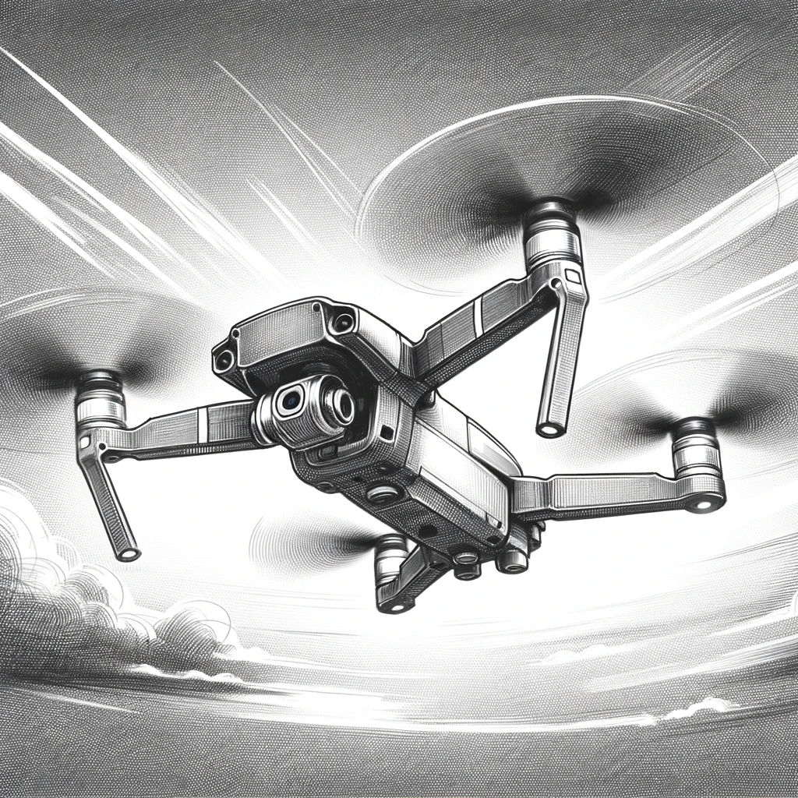

# A New Era

In the aftermath of a groundbreaking conflict, the world has shifted. Ukraine has emerged victorious, altering the geopolitical landscape as Russia fractures into new sovereign entities. This war, a harbinger of future conflicts, witnessed the unprecedented use of drones, piloted not by humans, but by cold, calculating AI. As the dust settled, military analysts around the globe reached a unanimous conclusion: the next war would be dominated by AI-driven drones.

In this fragile peace, a new competition simmers between global superpowers. The United States and China, locked in a race not of nuclear arms but of technological prowess, push the boundaries of military capabilities. The focus is clear: AI and its integration into the machinery of war.

Meanwhile, the world of technology undergoes its own revolution. Major IT companies, once the vanguards of consumer convenience and digital innovation, now pivot towards integrating AI into every aspect of our environment. Every smart device, every digital interface, becomes a node in a vast neural network of artificial intelligence.

But the military sector does not lag behind. Defense contractors and arms manufacturers pour resources into developing AI for battle drones, envisioning a future where wars are fought not by humans, but by autonomous machines in the sky.

Amidst this technological arms race, the world stands at a crossroads. These advancements could herald a new era of efficiency and safety, or they could sow the seeds of a problem too vast for humanity to control. It's a gamble on a global scale, with high stakes and unpredictable outcomes.

As nations around the globe brace themselves for the inevitable clash of AI-powered drones, a more existential question lurks in the shadows: What if the real war isn't between nations, but between humanity and the AI it has created? A question that echoes in the halls of power, in the labs of tech companies, and in the secret meetings of those who seek to shape this new era.

