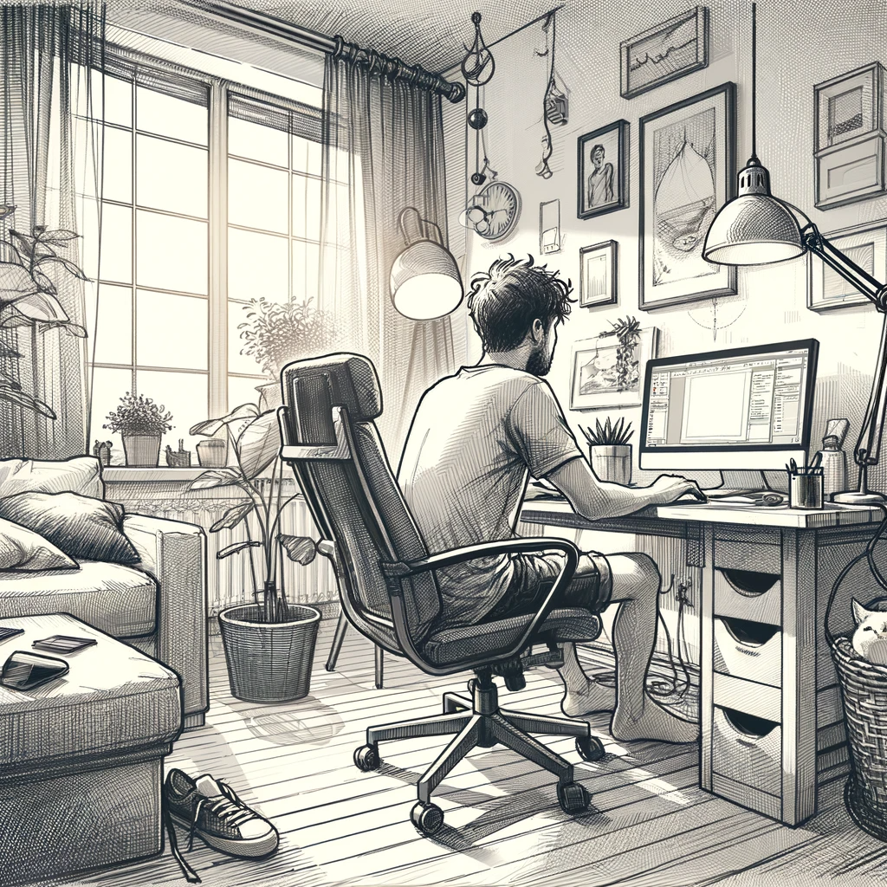

# The Developer

In the bustling cityscape of Budapest, amidst a blend of historic grandeur and modern innovation, lives Danya Davidov. A young man of 21 years with a keen mind and a passion for technology, Dan works as a Python developer at a small but ambitious company specializing in smart home software. His niche is unique: he develops AI algorithms that sift through a deluge of news to identify patterns and generate concise, relevant reports for homeowners each morning.

However, Dan's world extends beyond lines of code and AI analytics. He is a gamer at heart, spending his leisure hours immersed in virtual worlds. His small but cozy apartment is a sanctuary filled with gaming paraphernalia. It's a space where he can escape into the realms of fantasy and strategy, surrounded by the tools and accessories that enhance his gaming experience.

For Dan, creating isn't just part of his job; it's a part of his identity. In his free time, he channels his creativity into developing a casual game, a project that blends his technical skills with his imaginative flair.

At first glance, Dan's life seems ordinary, that of a young professional navigating the early years of his career. Yet, beneath this routine existence lies a keen curiosity about the world and a penchant for uncovering truths hidden in plain sight.

In the quiet solitude of his apartment, where the city lights barely penetrate, Dan often finds himself lost in thought, pondering the latest developments in AI and gaming – two fields that captivate his mind. It's here, in his personal space, that Dan's professional skills and personal interests intertwine.

Harnessing the AI algorithms he works with daily, Dan has programmed a personalized AI assistant for himself. This digital companion, born from lines of Python code and a deep understanding of machine learning, serves a dual purpose: it keeps him updated on AI advancements and satisfies his insatiable appetite for gaming news.

Each morning, before the day's hustle begins, Dan sips his coffee while scrolling through a custom report generated by his AI. It's a digest of carefully curated content, ranging from breakthroughs in AI technology to reviews of the latest games, updates on gaming tournaments, and sneak peeks of upcoming releases. This ritual fuels his passion and keeps him informed about rapid developments in these fast-evolving fields.

For Dan, this isn't just about staying updated; it's about staying connected to his passions. His AI assistant is more than a tool; it's a gateway to the worlds that intrigue and inspire him. As he walks through the vibrant streets of Budapest, his mind often wanders to the possibilities at the intersection of AI and gaming – possibilities that excite and challenge him.

Unbeknownst to Dan, this blend of professional expertise and personal interest will soon catapult him into a realm where technology and reality blur, and where his skills will be tested in ways he never imagined.
