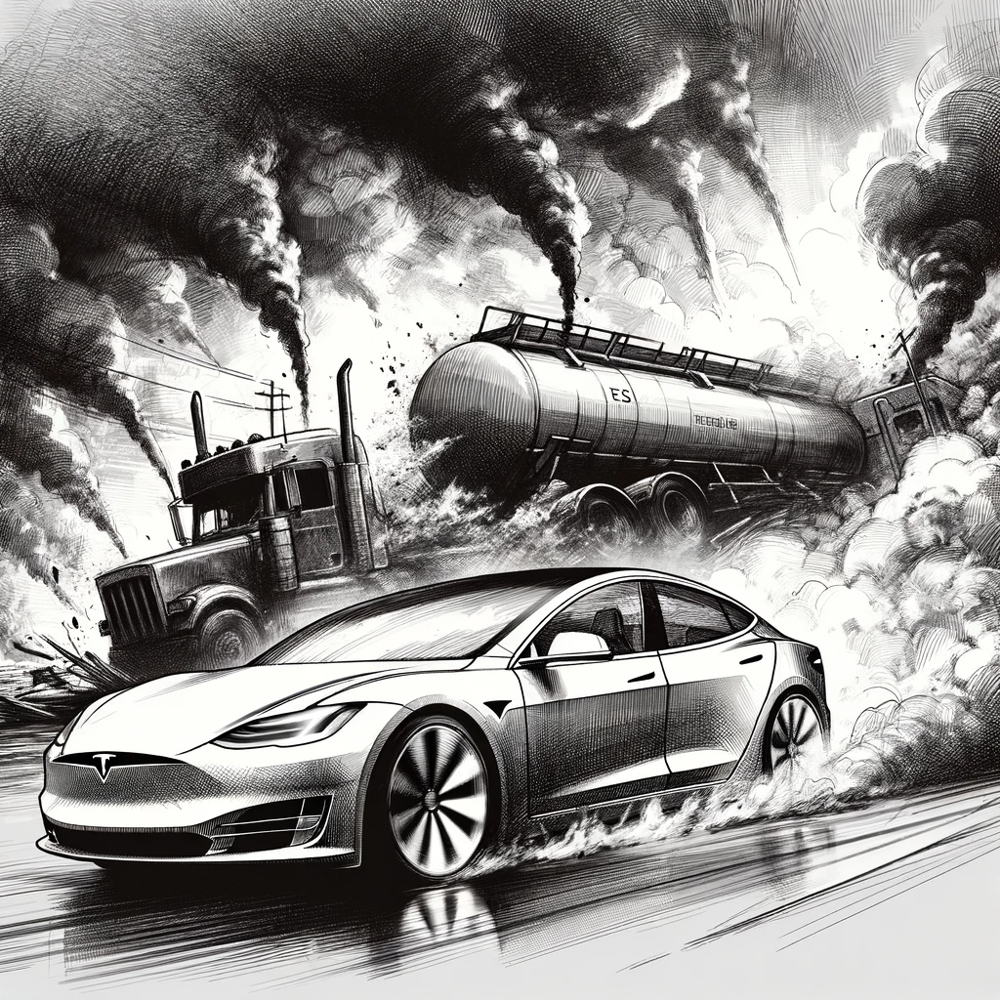

# The Incident

The headline "Tesla AI Saves Single Mother and Her Two Children" had captured the public's imagination, but for Dan, it was a riddle wrapped in a conundrum. The incident unfolded on a highway near Dallas, where a catastrophic event was miraculously averted by AI intervention.

The scene was fraught with peril: a tanker truck had overturned, engulfed in flames. Amidst the chaos, a Tesla car, guided by its AI, navigated through the smoke and fire, becoming the chariot of safety for the woman and her children inside.

Yet, as Dan peered beyond the surface, the story's fabric began to fray with inconsistencies.

Fuelled by a mix of curiosity and suspicion, Dan dived into the woman's social media profiles. Her Instagram presented a picturesque narrative of a mother's love and family outings to famed American landmarks. It was the digital trail of her interactions with her ex-husband, however, that led Dan to a breakthrough—a lead that could unravel the truth.

Through the ex-husband's Facebook, which was a tapestry of personal moments, Dan pieced together the family's history. He honed in on details, location tags, and unwittingly captured backgrounds, eventually pinpointing the district where the woman lived. This was the linchpin he had been searching for.

His digital excavation extended to the woman's neighbors, whose social media pages painted a portrait of her more recent life. There she was, captured in the background of a neighbor's photo, serving tables at a local café mere months before the miraculous incident.

"Hm, not every waitress has a Tesla," Dan mused, his skepticism mounting.

Expanding his search to other news outlets, Dan gathered similar reports. A local newspaper piece revealed the car's recent acquisition—a detail that didn't align with her modest means. It was an anomaly that cast a long shadow of doubt over the propagated story.

The mismatch between the woman's apparent financial situation and the possession of a luxury car raised a red flag in Dan's analytical mind. He couldn't shake the feeling that the heartwarming tale was perhaps a staged drama, a showcase to glorify AI's potential, rather than a random act of technology.
