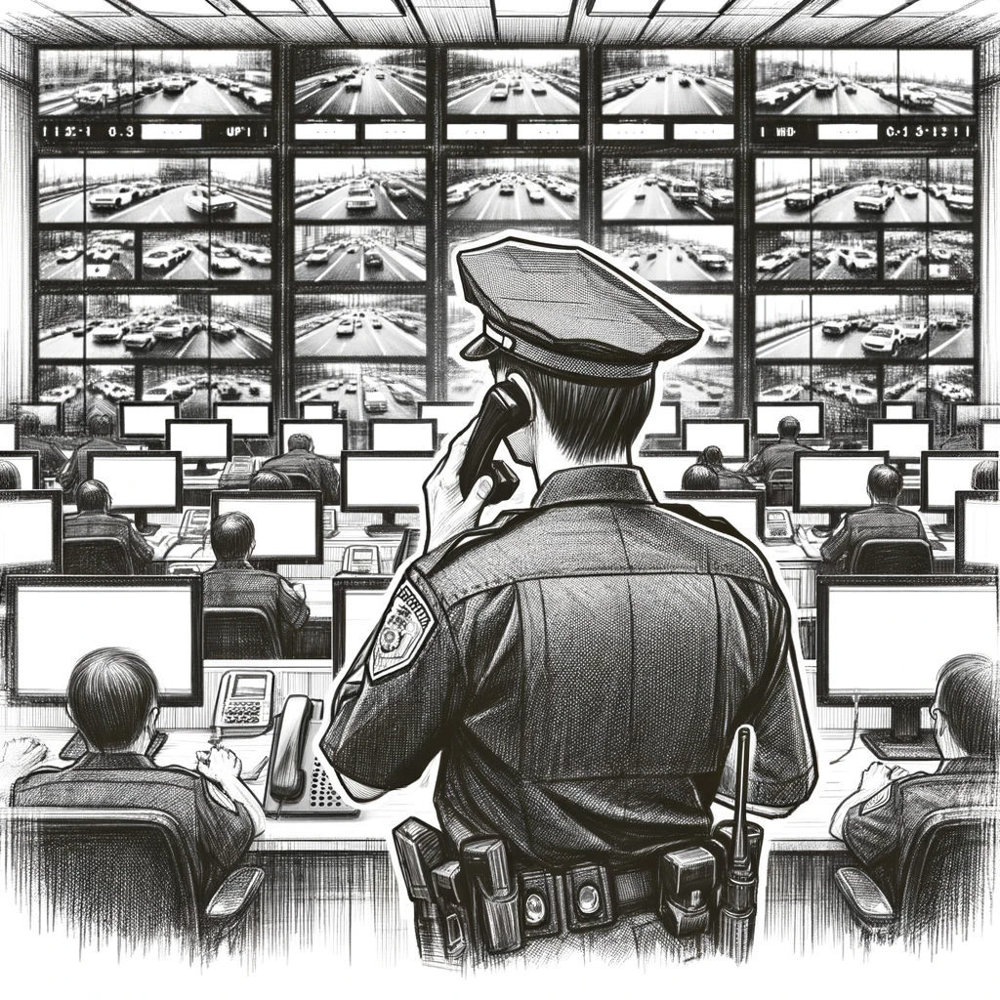

# A Risky Call

Dan's suspicions about the Tesla incident deepen as he scrutinizes the video footage from various news agencies. The absence of a watermark, typically added by the police for authenticity and tracking, strikes him as highly irregular.

"Sometimes we try to find something abnormal, and it's hard to find. But sometimes you're missing something, and that key is even harder to find," a thought crosses Dan's mind, highlighting the unexpected nature of his discovery.

Determined to uncover the truth behind this anomaly, he decides on a direct approach – a phone call to the Dallas road police.

"Madness, I must be out of my mind," he murmurs to himself.

With caution and strategic planning, Dan sets up an anonymous temporary phone number, purchased with cryptocurrency, to ensure his call cannot be traced back to him.

Using AI technology, he modifies his voice to mimic Mayor Johnson of Dallas, thinking, "Thanks to the abundance of public records featuring the Mayor, I hope it's enough for a convincing result." This ruse is intended to add credibility and urgency to his inquiries.

Taking a deep breath, Dan dials the number. As the phone rings, he steadies his nerves, bracing for the conversation ahead.

— Hello, it's Mayor Johnson. Can I speak with the Chief?

— Yes, of course. I'll connect you right away, sir - the officer promptly responds.

— Hello, it's Mayor Johnson - Dan jumps right into his query, leaving no room for doubt.
— What's happening? Why is your video about the Tesla incident being used by every news outlet?

After a tense silence that stretches so long Dan nearly hangs up, a confused and slightly offended voice finally responds.

— But, but, sir, you instructed us to release the video immediately...

Dan is as surprised as the officer. The revelation that the Mayor himself had apparently ordered the footage's release adds an unexpected layer to the story. Thinking quickly, he feigns indignation:

— But the watermark, you forgot the watermark! You're going to get me into trouble.

Without waiting for a reply, Dan abruptly ends the call.
