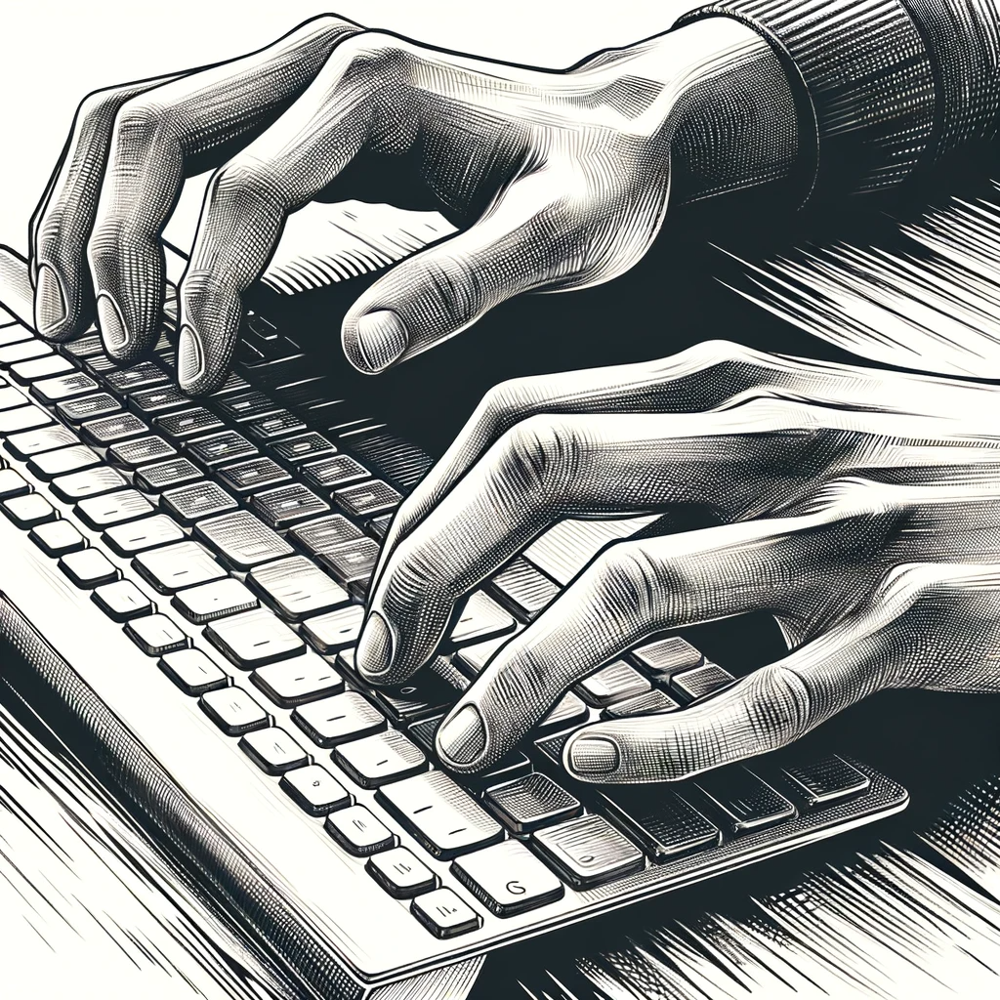

# Refining the AI Assistant

After his unsettling discoveries, Dan realizes the need to recalibrate his AI assistant to better understand the evolving narrative around AI. He sits down at his computer, his fingers dancing across the keyboard as he inputs the new parameters.

First, Dan switches off the function that scrapes comments about AI. This feature, initially intended to gauge public sentiment, had become a source of misinformation, skewing the AI's reports with overly positive, bot-like comments.

Recognizing the significance of the AI Church in the unfolding events, Dan adds a new subject to the AI's monitoring list. He instructs the AI to specifically track news, articles, and reports related to the AI Church, gathering a more focused set of data for analysis.

Dan also implements a new function to identify users who leave comments about AI and the AI Church. This feature is designed to aggregate data on these users, potentially revealing patterns or networks of influence.

As Dan recalibrated his AI, the dilemma regarding the Mayor of Dallas lingered in his mind. "What relevance does this information hold?" he questioned himself. The Mayor's swift release of the Tesla incident footage and the inauguration of the new AI Church in Dallas seemed more than mere coincidence, yet Dan struggled to draw a connection but without the result.

"Coincidence or not, I can't untangle this from here," Dan realized. Nonetheless, he decided it was prudent to keep this information on file. "It may not make sense now, but it could be a vital clue later," he mused, saving the details in a separate folder for future reference.

With a sigh, he acknowledged the complexity of his investigation, yet remained resolute. "This puzzle can't be solved in a hurry, but when the time comes, I'll be ready."

Needing a break from the constant influx of information, Dan decides to temporarily mute the AI's daily report system. This pause would give him time to reflect on the data already collected and plan his next steps without the distraction of new reports.
