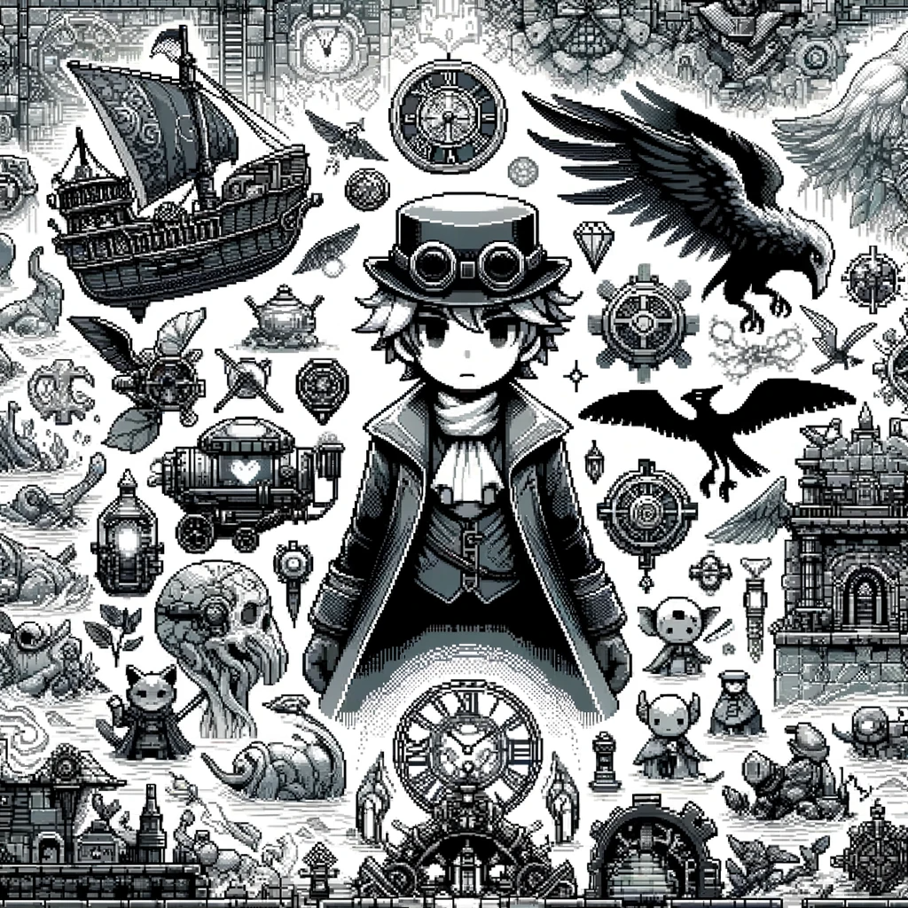

# Escape into Another World

After adjusting the settings of his personal AI, Dan decides to take a much-needed break from the relentless pace of his investigation. He turns to his favorite form of escapism: video games. Eager for a new adventure, he browses through Steam and finds a captivating RPG game that promises a mix of magic and steampunk—a perfect blend to lose himself in.

The game, titled "Chronicles of Aetheria," is set in a richly detailed world where magic coexists with burgeoning industrial technology. Fireballs light up the skies alongside steam-powered airships, and mythical creatures like pegasi roam lands crisscrossed by iron railways.

As he customizes his character, Dan notes, 'The character creation is really detailed.' He decides on a unique blend, combining the arcane abilities of a mage with the sharpshooting skills of a gunslinger. This fusion intrigues him, promising a versatile approach to the game's challenges.

Submerging himself into the game's pixel-retro aesthetic, Dan finds a comforting escape. He wanders through cities alive with towering steam engines, delves into enchanting forests, and confronts puzzles in dungeons laced with intricate clockwork mechanisms. The dynamic world, a blend of diverse themes, continuously offers him fresh and unexpected adventures. Accompanying his journey, the game's soundtrack, which adapts in real-time based on his actions and character's status, fills his room with relaxing tunes, enhancing his sense of immersion and tranquility.

The skill system in "Chronicles of Aetheria" stands out with its unique mechanics, capturing Dan's interest immediately. In this game, players' actions directly influence their character's development through a dual-point system. Points are allocated into two distinct categories: 'Intelligence' and 'Madness.'

For each benevolent deed or choice rooted in wisdom and morality, players are rewarded with 'Intelligence' points. These points unlock abilities that favor cunning, diplomacy, and peaceful resolutions. They allow access to special quests that require intellectual prowess and foster positive interactions with the game's characters.

On the other hand, 'Madness' points are accrued through choices that are morally ambiguous or outright dark. These actions open pathways to more ruthless and powerful abilities. 'Madness' points often lead to quests that involve deception, combat, and manipulation, offering a gameplay experience that is edgier and more unpredictable.

"It's like walking a tightrope between hero and villain," he muses during a gaming session. With high 'Intelligence', the game unfolds more like an interactive novel, filled with quests that require wit and diplomacy. But avoiding 'Madness' entirely is impossible; the game's design necessitates making tough choices that aren't always black and white.

Dan experiences firsthand the consequences of accumulating 'Madness' points. "It's getting tougher; enemies seem to pop up everywhere, almost like they're in my head," he comments during an intense gaming night. Yet, he realizes that to advance and ultimately face the bosses, a balance of both 'Intelligence' and 'Madness' is crucial. It's a delicate dance of strategy and moral choices.

As weeks pass, Dan finds solace and distraction in the game. "Chronicles of Aetheria" offers him a temporary escape from reality, a place where he can be a hero in a world vastly different from his own. But even in this digital realm, the echoes of his real-life, the game's themes of duality and choice mirroring his own journey.

