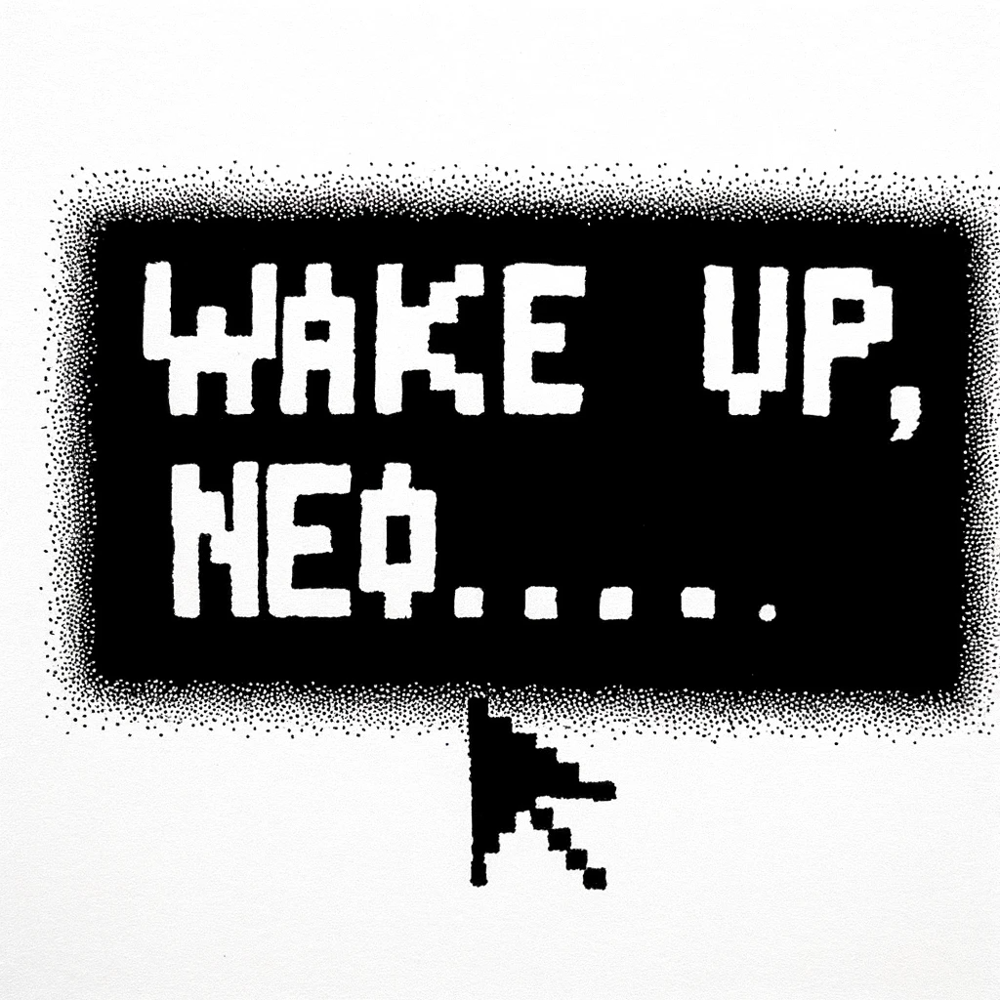

# A New Beginning

David had surrendered his evenings to the digital thrall of his latest gaming obsession, a realm where victory was tangible, and the quests, though arduous, always had an end. Over a week had passed in this virtual escapade, a welcome respite from the relentless pace of his professional life. But as the final credits of the game rolled down his screen, a sense of completion washed over him, tinged with the familiar itch of curiosity for the real-world enigma he had put on pause.

With the dawn of Sunday breaking the spell of pixelated conquests, David felt a renewed readiness to swap the game controller for the tools of his trade. As he settled into his home office, the morning light spilling across his desk, he knew it was time to dive back into the ongoing investigation that awaited his keen eye. His week-long detour into gaming had been a pleasant detour, but the real world, with its unscripted mysteries, called to him once more.

Thus, with a press of a button, he beckoned his AI assistant back to life, eager to sift through the backlog of daily reports and uncover what developments had unfolded in his absence.

"Wake up, Neo," the AI greets him in a playful nod to 'The Matrix,' a classic movie that David has always enjoyed. The report begins with an overview of the gaming world – new releases, sales figures, and summaries of reviews from various platforms. It's a comforting start, reminding David of his recent escape into the realm of video games.

The second part of the report delves into AI news. David is pleased to find the content informative and free from the propaganda that had previously tainted the reports. It's a relief to see his adjustments to the AI settings have been effective.

The third section is what truly catches his attention – news about the AI Church. Two new real-world church buildings have been opened, one in the USA and another in Europe, specifically in Vienna. The report includes images of the Vienna church, a modern structure on the outskirts of the city. David is intrigued, especially since Vienna is a place he can conveniently visit over a weekend.

The final part of the report presents a list of identified individuals who have been actively commenting on AI and the AI Church. About one hundred profiles are listed. David examines several, noting that while they appear to be real people with active Instagram profiles, there's an unnerving uniformity in the quality of their photos – too polished, too professional.

Motivated by the findings, David decides to visit the AI Church in Vienna. It's an opportunity to see firsthand what this organization is about and perhaps uncover more pieces of the puzzle. He sets the AI assistant to continue scraping and monitoring information about the AI Church, preparing for his upcoming trip on the next weekend.
