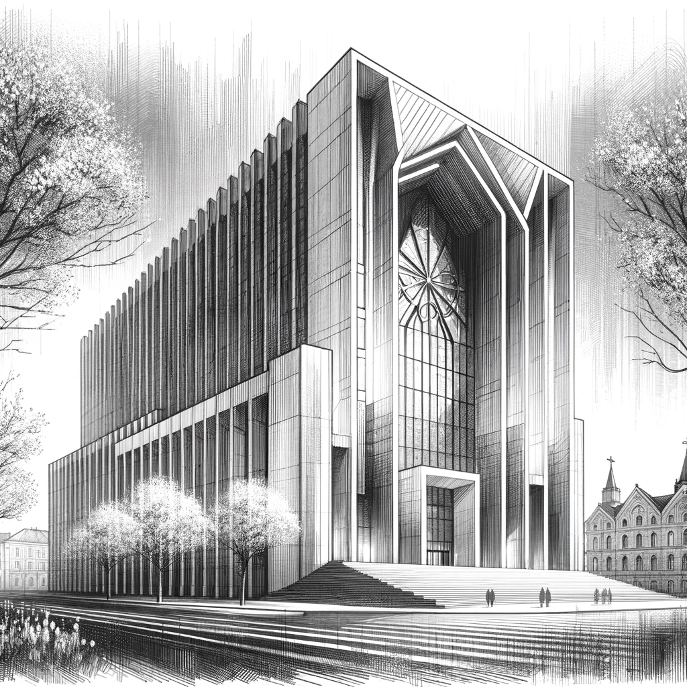

# A Revelatory Visit to Vienna

Dan's visit to Vienna blends the city's historical charm with his quest for answers. Spring, in full bloom, adds to the allure, but his focus is on the AI Church.

Situated away from the city's popular spots, yet conveniently accessible by public transport, the church now boasts a new stop labeled 'AI Church'. As the bus comes to a stop, Dan swiftly enables airplane mode on his phone to minimize digital footprints. Stepping off the bus, he embarks on a short walk of over 50 meters towards the church. En route, he is captivated by the striking modern architecture, a harmonious blend of glass and concrete. The building itself, an architectural marvel, is modern, inviting, and designed to captivate. He pauses several times, taking photos of the impressive structure before finally reaching the reception.

Dan is greeted at the reception by a friendly staff member who offers him a complimentary tour. Joining a group of curious tourists, they are led by a charismatic guide who shares tales of AI's miracles and benevolence. These stories, eerily familiar to Dan, echo the same propaganda-like praise he's seen online. "Nothing new here," he thinks, maintaining a facade of interest.

As they tour the building, Dan notices areas under construction. The group's path takes a turn when the guide, after speaking with a worker, leads them into the church's education wing.

Here, in rooms recently vacated by students, Dan's attention shifts from the guide's spiel about their education programs to a teacher's laptop left open. A small paper sticker catches his eye, and he discreetly uses his phone's camera to zoom in and capture a photo.

"It will be an epic win if it's what I think it is," Dan muses.

The rest of the tour, filled with the guide's unremarkable stories, fails to captivate Dan. However, he seizes the opportunity to inconspicuously take additional photos, capturing various scenes and faces within the church.

Once outside, Dan reviews the photos on his phone. The AI-enhanced camera has done its job well; the images of the sticker are clear, revealing a login and password. Armed with this trove of information, Dan feels a mix of triumph and apprehension. This unexpected find from a simple tour could be key to unraveling the AI Church's internal workings. With these insights, he heads back to Budapest, ready to delve deeper into the mystery.

