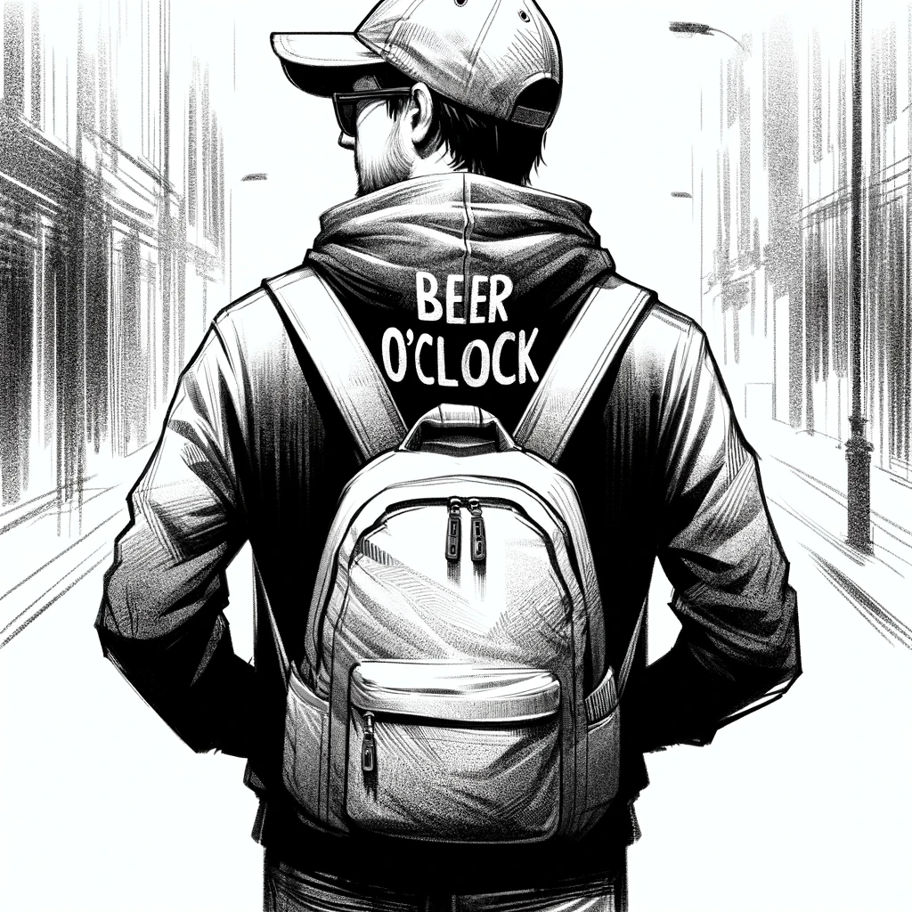

# The Preparing

Back in Budapest, Dan faces the challenge of accessing the site of the AI Church. His first attempts to open the site with several VPNs prove futile. The site requires access to the Church's internal network, a task far beyond the reach of his current tools.

Undeterred, Dan contemplates his options. Finding access to the Church's VPN is a near-impossible task, but what about its Wi-Fi network? During his previous visit, he hadn't checked for a public Wi-Fi connection, but he suspects the site he needs wouldn't be available on a guest wifi network.

"Thinking, thinking, thinking..."

The solution, he realizes, lies not only in finding a private WiFi but also in cracking the Wi-Fi password to gain access to the Church's internal network. For this, he plans to use an ESP32 Marauder, a tool they use at his workplace to test the security of their Smart Home systems. Dan is familiar with its operation and confident in its ability to help him infiltrate the network.

However, Dan is aware of the legal and ethical risks of such an endeavor. To avoid using his personal devices, he decides to purchase a tablet solely for this operation. After some searching, he finds a Lenovo tablet at a surprisingly low price—likely refurbished or stolen, he muses. Paying in cash, he ensures the transaction is untraceable.

Equipped with the ESP32 Marauder and the newly acquired tablet, Dan plans his second trip to Vienna. He decides to wait until the next weekend, giving him time to prepare and ensuring he won't arouse suspicion with frequent visits.

Dan meticulously prepares for his undercover role. He changes his hairstyle to something less conspicuous and buys a pair of glasses to alter his appearance. Digging through his wardrobe, he finds an old hoodie and cap, gifts from a friend that he never wore; adorned with humorous "beer o'clock" jokes, they make him look like a beer enthusiast. Despite their comical nature, he chooses them for their inconspicuousness.

Going over his plan repeatedly, Dan understands the risks involved but also knows this may be his only chance to access the information he seeks. With a mix of anticipation and anxiety, he readies himself for a journey that could plunge him deeper into danger, blending in with a casual, unassuming look.

