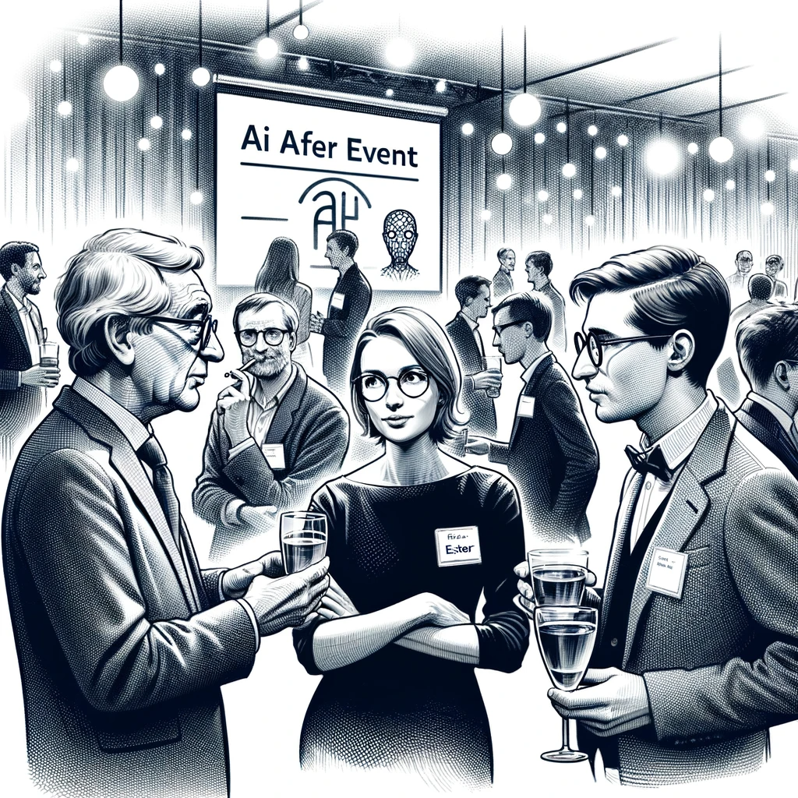

# The After-Party

Dan, typically not a fan of after-parties, finds himself unexpectedly engrossed in a discussion at the AI Church conference's social event. Surrounded by the ambient noise of clinking glasses and background music, he joins a group of three AI Church members deeply engaged in a debate about AI ethics.

A middle-aged man with a scholarly look, accentuated by round glasses and graying hair, adjusts his glasses thoughtfully as he continues the conversation, which Dan's appearance had interrupted. "It all comes down to Asimov’s three laws, doesn't it? But are they sufficient for today's AI, especially in warfare?"

A woman, her badge inscribed with 'Eszter' in handwritten marker, responds, "Exactly, Tibor. It's not just about theoretical rules. We need practical, enforceable guidelines that address real-world implications. How do we ensure AI is used for the greater good and not just for profit or, worse, militaristic purposes?"

The third speaker, sporting a badge named 'Gábor,' folds his arms, interjecting with a hint of caution in his voice. "The challenge lies in implementation. Drafting ethical guidelines is one thing, but global enforcement is another. AI isn't bound by national borders. We need international cooperation and a global consensus on AI ethics."

Tibor nods in agreement. "That's where organizations like the AI Church can play a role, right? Advocating for ethical AI use and fostering discussions like this one."

However, Eszter appears skeptical. "True, but advocacy can only achieve so much. We've seen how even well-intentioned groups can harbor conflicting interests. The key here is transparency and accountability in AI development and deployment."

Gábor concludes, "Absolutely, transparency is crucial. As members of the AI community, we have a responsibility to advocate for it. Ethical AI isn't just an objective; it's a journey, and we're all part of it."

Dan listens intently, struck by the depth of their concerns, especially given their association with the AI Church—an organization he knows manipulates public opinion about AI. This conversation reveals a stark disconnect between the Church's public facade and the individual beliefs of its members.

The after-party, which Dan had attended out of obligation, turns into an insightful experience...
