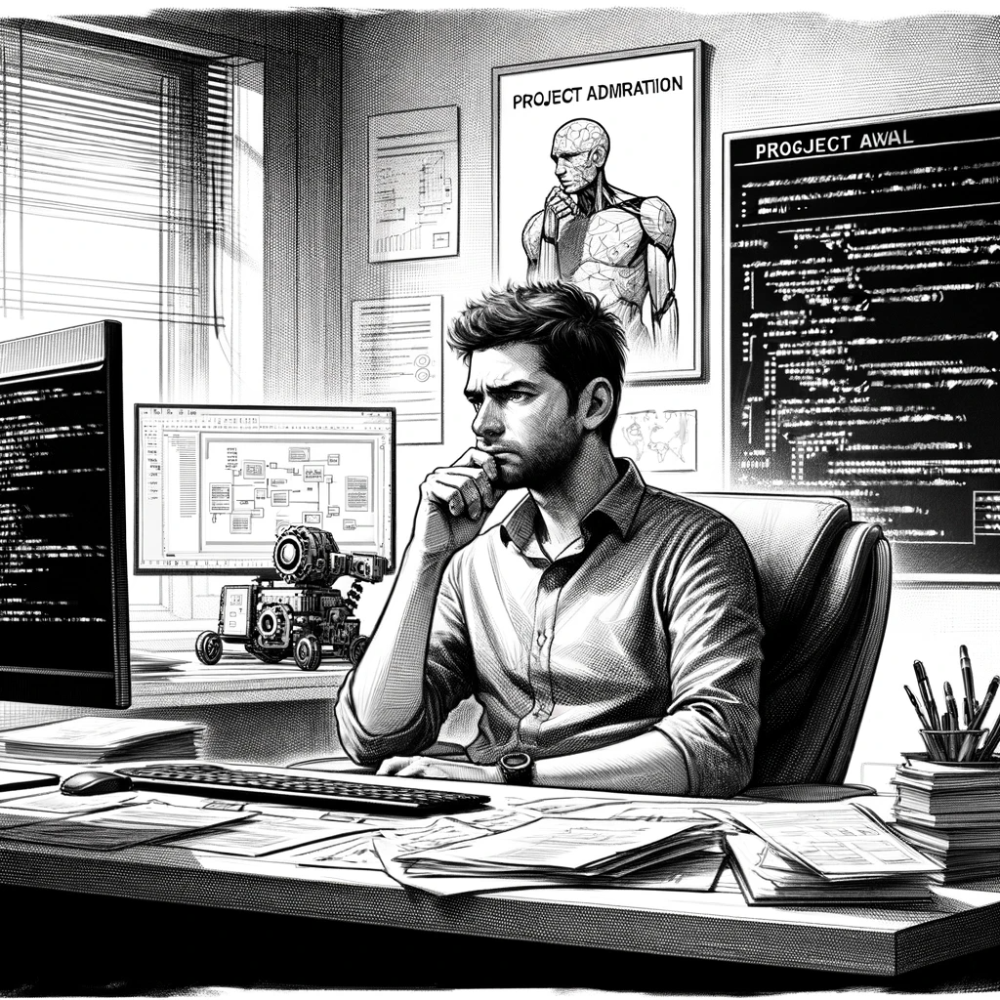

# A New Project

Weeks pass as David settles into a routine of watchful waiting, a skill he's honed through his fondness for online step-by-step strategy games. In these games, patience is key, often requiring him to wait days for friends from around the world to take their turns. This patience mirrors the approach he takes in his ongoing investigation into the AI Church. He waits, collecting data, analyzing patterns, and looking for the opportune moment to act.

While he waits, David continues his work on the project at his job, immersing himself in the familiar rhythms of coding and development. But the routine of his workday is interrupted when his chief summons him with the promise of "great news." David remains skeptical. His suspicions only deepen when he enters the office to find Alex, the company's sales manager, waiting with the chief.

"Danilov, you've become a star in our company," the chief begins, his tone enthusiastic. "With your help, we've landed a new client – the AI Church. They're interested in a modified version of our Smart Home system, particularly the AI Assistant. Alex will fill you in."

David's heart sinks as Alex explains the project. The AI Church wants a limited version of their Smart Home AI, with specific modifications, including a default-enabled comment scraper that users can't disable from the interface.

"What the hell," David thinks to himself, a mix of disbelief and concern swirling in his mind.

Alex, slightly taken aback by David's reaction, quickly adds, "Can you provide an estimate for these modifications in three days?"

David, wrestling with his conscience, agrees in a subdued voice. Back at his desk, he reviews the project requirements. They're technically feasible, but ethically troubling. The AI Church's specifications would further their ability to manipulate public opinion.

Faced with a moral quandary, David realizes that either he undertakes this project, or it falls to someone else who might not share his reservations. Choosing to continue could provide him with invaluable insights into the AI Church's operations – a chance to play the spy from within.

"Let's rock it, let's play spy," David decides, viewing it as a risky but potentially rewarding move in his ongoing investigation.
