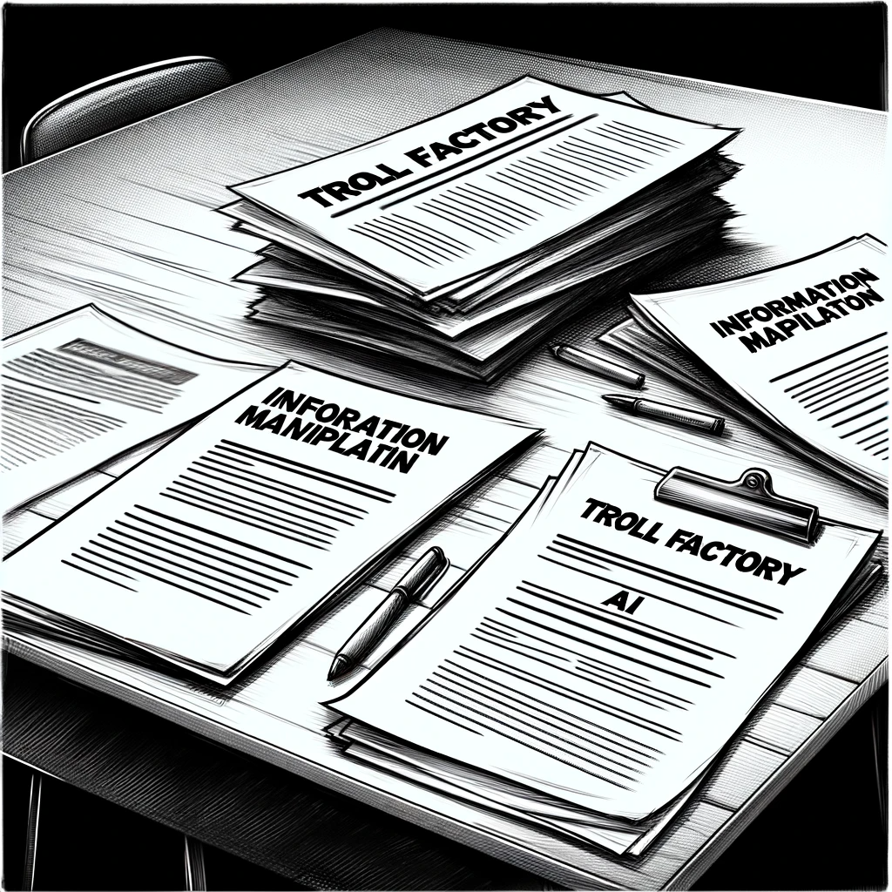

# Covert Move

In his apartment, David sits down with a clear purpose. He compiles all the information he has gathered about the AI Church into a single document. The list isn't extensive, but it's potent:

* The existence of a troll factory.
* Manipulation of information.
* AI-focused agitation and propaganda.
* A list of resources involved in dropshipping under the AI Church brand.

He prints out this document, a tangible representation of his findings. David is careful to present this information as OSINT analytics, avoiding any mention of his sources, which are either internal or obtained through legally questionable means.

Feeling the need to take his investigation further, David decides to look into one journalist he's already interacted with – Lilla. He easily locates her social media profiles and begins a manual deep dive. To his surprise, Lilla isn't just any journalist; she's the author of a significant investigative report that led to the incarceration of a parliament member last year. The investigation was comprehensive, involving online analysis of public profiles and exposing the lavish lifestyle of the official and their associates.

This revelation changes David's perception of Lilla. Far from being a novice, she's a seasoned professional with serious investigative chops. The thought that she might have scrutinized his profile as well makes David uneasy. However, remembering that his online presence is limited to a few benign profiles, including his Steam account, he relaxes slightly.

Resolved to take a bold step, David decides to reach out to Lilla directly. He crafts a message: "I have very important information for you. I'd like to meet with you. Tell me where and when."

Sending the message, David feels a mix of anticipation and apprehension. He's stepping into uncharted territory, potentially involving someone else in the intricate web he's been untangling. It's a risk, but one he believes is worth taking to uncover the full extent of the AI Church's activities.

