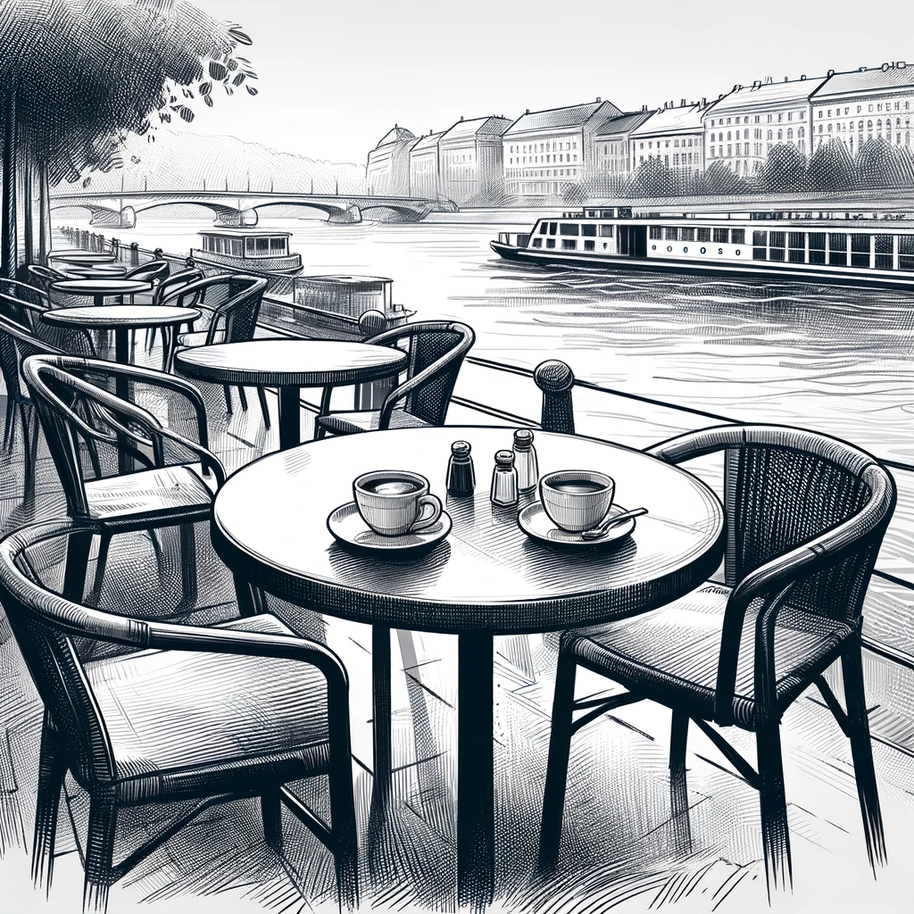

# A Meeting by the Danube

David arrives at the café along the Danube River, just a subway stop away from his office. The location, chosen by Lilla, is perfect for a discreet meeting. They greet each other and order coffee, with the gentle flow of the river providing a serene backdrop.

As they settle in, David begins to narrate his findings, carefully omitting his trips to Vienna and specifics from his job. Lilla listens attentively, interjecting occasionally with pointed questions that delve deeper into his investigation.

Concluding his story, David hands her the paper containing all the information he has compiled. Lilla quickly stashes it in her bag, her expression turning serious. "This is incredibly interesting," she remarks. "Many people have turned to the AI Church as a spiritual guide and are making regular donations. This information could be crucial."

Her next words catch David off-guard. "I was honestly shocked when you contacted me. I thought you were asking me out on a date, but this... this is significant."

David, slightly embarrassed but amused, responds, "You thought it was a date and still agreed to meet? Interesting."

Lilla smiles wryly, a hint of playfulness in her eyes. "Maybe next time. Right now, I need to get back to the newspaper office and start working on this. It's too important."

David insists on paying for the coffee, a gesture to compensate for the unexpected nature of their meeting. "At least let me cover this, even if it's not a date."

"I'll let you," Lilla says, smiling as she stands up to leave. "Sorry, I really have to go. See you later."

Left alone, David orders another coffee and a cheese sandwich, his mind racing with the implications of their conversation. "Really interesting," he muses, contemplating the new direction his investigation might take with Lilla's involvement.
