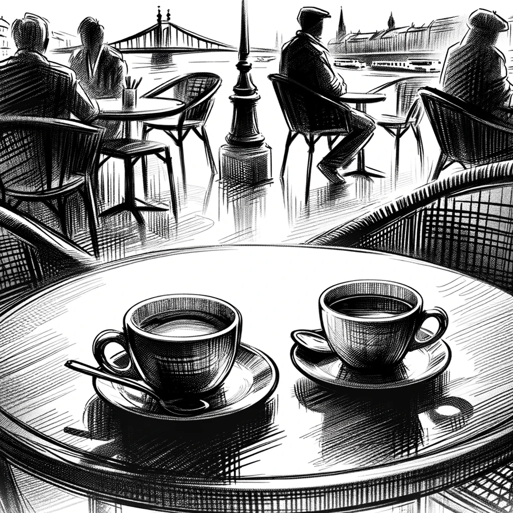

# A Chilling Revelation

Dan arrives at the café on time, the same place where he had first shared his findings with Lilla. He orders coffee and waits, his mind pondering the possible reasons for this sudden meeting. Lilla's message had been abrupt and devoid of the casual tone of their previous encounter. Something significant must have transpired.

Lilla arrives ten minutes late, her usual composed demeanor replaced by visible nervousness. "Sorry for being late, and for the late message," she begins hurriedly, sitting down across from Dan. "I need to tell you something important. I can't continue with this investigation."

Dan's heart sinks as Lilla explains, her words laced with fear. "It's not about the caliber of the investigation. It's about safety. My editor and I have decided to stop. We've come across some very dangerous people affiliated with the AI Church – people capable of real harm."

Dan starts to interject, but Lilla cuts him off. "Please, let me finish. My editor is a brave man, we've faced threats before, but this is different. These people are killers, and they've killed before. I can't put myself or my editor, who has a family, in such grave danger."

Dan remains silent, absorbing the weight of her words. Lilla's fear is palpable, and he realizes that this might be the end of the road for his investigation.

"May I order a coffee?" Lilla asks after a pause. Dan nods, and she orders a latte.

Lilla sips her coffee, trying to compose herself. "I'm sorry, Dan," she repeats.

"It's okay, you tried. That's important," Dan replies softly. "Can you tell me anything about who scared you?"

She hesitates, then shares, "We don't know much, only a call sign – Ifrit. He's done terrible things, even for the government. That's all I can say."

The mention of 'Ifrit' resonates with Dan – the Ifrit is a demon from the underworld, and also a unit from the game Heroes Of Magic 3, a detail that sticks in his mind.

The conversation stumbles on, but it's clear that Lilla is eager to leave. She departs shortly after, leaving Dan alone with his thoughts and the unpaid coffee bill.

Dan remains seated, his coffee untouched, as he contemplates the name 'Ifrit' and what it represents. The investigation has taken a darker turn, revealing layers of danger and complexity he hadn't anticipated.

