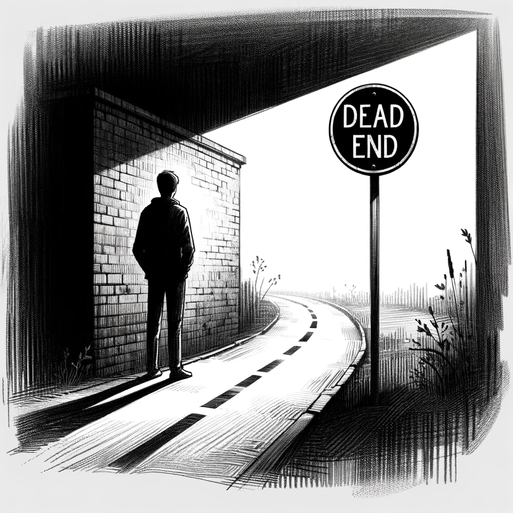

# A Stalemate

Returning home from the café, Dan feels a mix of disappointment and resignation. He respects Lilla's decision to withdraw from the investigation, understanding the grave risks involved. Alone with his thoughts, he tries to process the information about 'Ifrit' but hits a dead end.

Determined, Dan exhausts every possible avenue to unearth details about this enigmatic figure. He scours online databases, public records, and even delves into less conventional sources, yet finds nothing substantial. Turning to his AI assistant, he adds 'Ifrit' as a keyword, hoping for a breakthrough. Weeks pass, but the AI assistant yields no results either.

The network of people affiliated with the AI Church, as mapped out by his AI, is extensive – over a thousand individuals. Yet, there's no mention of anyone with the nickname 'Ifrit.' It's as if this person operates in the shadows, leaving no digital footprint. Dan realizes that the loyalty within the AI Church's network is deep-seated. It's not the kind of loyalty that can be bought or easily infiltrated. It's a loyalty born out of shared beliefs and convictions, making it all the more challenging to find a breach.

Dan leans back in his chair, feeling the weight of a dead end. His investigation into the AI Church had started with promise but now seems to be at an impasse. The mystery of 'Ifrit' and the AI Church's inner workings remain just that – mysteries.

Despite the lack of progress, Dan isn't ready to give up. He knows that in investigations like this, patience is crucial. Sometimes, it's about waiting for the right moment, for a slip-up, or for a new piece of information to emerge. He decides to keep monitoring the situation, keeping the AI assistant active and staying alert for any new developments.

As he sits in the quiet of his home, Dan contemplates his next move. The journey has been complex and fraught with danger, but he remains committed to uncovering the truth, no matter how deep he has to dig.

