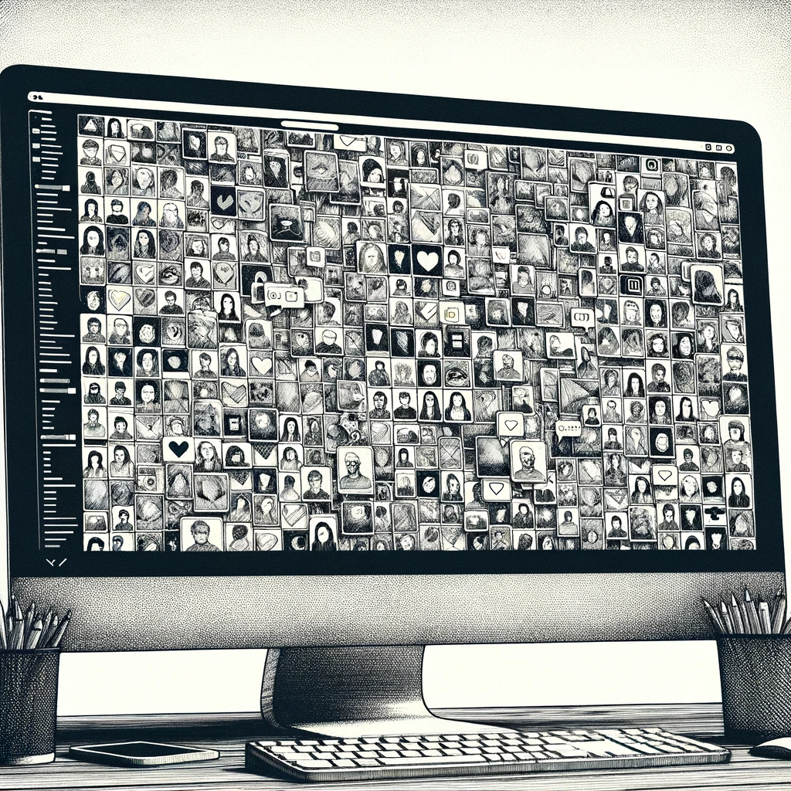

# The Summer of Realizations

As the summer heat intensifies, so does the pace of David's life, weaving through a summer filled with both climatic and professional fervor. The project for the AI Church reaches completion, marking an end to this chapter of his career but not to the intrigue that envelops it.

The AI Church's final request is for a monitoring system to track user engagement and conversion rates – a standard tool for any online platform, yet it feels different in this context. David can't shake off the irony: a church-commodifying faith, turning devotion into data points. And he, knowingly, is a cog in this machine.

Despite the project's end, David's quest for understanding continues. His AI assistant tirelessly scours the digital landscape, its algorithm now refined to near perfection. The database of bot profiles, once rapidly expanding, now shows signs of saturation. Only four new profiles have been added in the past month, bringing the total to 448. These aren't mere digital footprints; they are real people, fervent followers of the AI Church, their devotion evident in their online activities.

David's AI has become adept at recognizing these individuals, boasting a 99% accuracy rate in identification. Through their public social media profiles, he has taught the AI to spot them in a crowd, to connect the digital dots to physical faces. Yet, with all this technology at his fingertips, David finds himself at a crossroads, uncertain of his next move.

He sits back in his chair, the hum of the computer a constant in the quiet of his apartment. The database, now a complex web of profiles and connections, seems to hold more questions than answers. Where should he look next? What is he hoping to find? The AI Church, with its blend of faith and technology, has presented a puzzle that David is determined to solve, but the path forward is unclear.

As the summer wanes, so does the initial thrill of discovery, leaving David with a deep-seated need to understand the bigger picture. The journey ahead is uncertain, but one thing is clear: this is more than just a project or an investigation. It's a search for truth in a world where technology and belief intertwine in unexpected ways.
