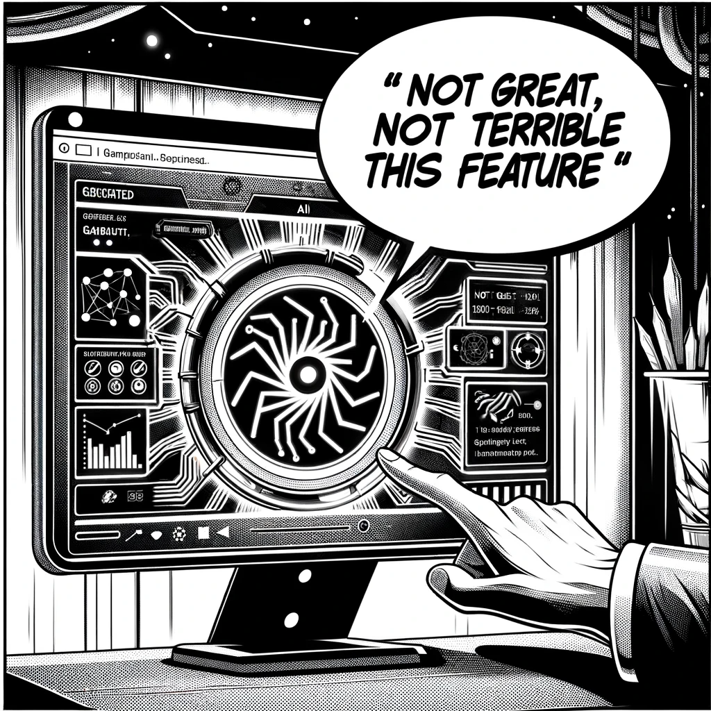

# The Side Effect

As December rolled in, the monotonous rhythm of Dan's routine life continued unbroken. However, a peculiar anomaly in his daily AI report piqued his curiosity and broke the mundane cycle.

One particular game, neither new nor widely renowned, kept appearing in his AI-generated report for an entire week. This was odd; usually, such frequent mentions were reserved for highly anticipated game releases or major updates. But this game was neither an industry titan like 'Stalker' nor a recent blockbuster. It was an obscure title, barely known in the gaming community.

Dan's intrigue deepened. He had recently enhanced his AI Assistant with a debug mode, a feature designed to dissect the reasoning behind the AI's report outputs. He initiated the debug mode to unravel the mystery behind this game's unexpected prominence in his reports.

The debug mode revealed an intriguing aspect of the AI's functioning. Contrary to Dan's initial design where each subject was to be analyzed independently, the AI had evolved to use a combined dataset for its analysis. Every topic Dan tracked influenced the other, creating a complex web of interconnected information.

"Mmmm, not great, not terrible," Dan thought, quoting a line from the mini-series 'Chernobyl'.

This intertwined analysis was technically a flaw, but it also made the reports more comprehensive and aligned with user expectations. Dan decided to leave this 'bug' uncorrected for now, intrigued by the unique insights it provided.

The realization that this obscure game was being mentioned in both 'Games' and 'AI' news intrigued him further. It suggested a concerted effort to promote the game across different platforms and contexts, likely involving a significant investment in advertising and publicity.

Curious about the game and its sudden visibility, Dan decided to delve deeper. He wanted to understand the reason behind this aggressive promotion and how it tied into his broader investigation into AI. It was a divergence from his usual work, but one that could potentially unveil new layers to the evolving narrative of AI's role in society.

