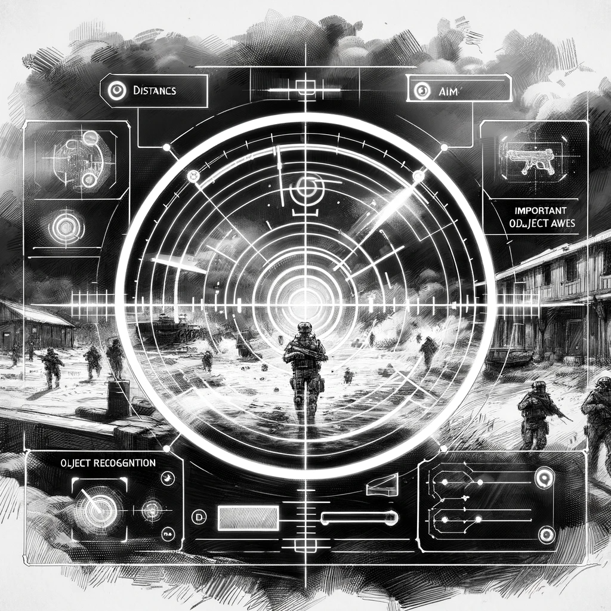

# The Unforeseen Chaos

Dan's exploration of The Dark Alert's gameplay revealed intriguing dynamics within the AI-controlled units. His observations, primarily through YouTube and Twitch streams, showed that the game was well-received by its player base. The AI's evolution from its initial release was noticeable, reflecting significant advancements in its decision-making and responsiveness.

However, Dan's interest lay beyond just the game's popularity. He was fascinated by how players utilized the AI troops within their units. Contrary to the game developers' intentions of promoting team play and coordination, players turned their AI units against each other. This unintended gameplay twist resulted in a chaotic Battle Royale-style showdown within the RU team, where commanders fought each other before facing the UA team.

"It's almost a mirror of the real Russian military, where each field commander seeks glory for themselves," Dan mused, amused by the parallels he drew while watching the gameplay videos. But the most intriguing aspect for Dan was the independent functioning of the AI within each trooper.

In "The Dark Alert," each AI-controlled trooper is endowed with the capability to independently analyze and react to the battlefield, but their actions are also influenced by the voice commands of the player. These commands are interpreted by the AI as direct orders, shaping the troopers' behavior and tactics. However, the uniqueness of the game lies in the individual perspective each AI unit has.

Every trooper, driven by its AI, views the battlefield from its distinct vantage point. This design choice results in a complex interplay between the player's commands and the AI's perception and interpretation of the situation. The AI units, while following the player's directives, also rely on their judgment based on their positioning and analysis of the battlefield.

This dual mechanism of control and autonomy creates a dynamic and unpredictable gameplay experience. Players must not only strategize their commands but also anticipate how their AI units might interpret and execute these orders. The challenge is compounded when friendly fire incidents occur, often due to the AI's misinterpretation or misidentification of allies as enemies.

Dan is fascinated by this feature. The nuanced interaction between player commands and AI decision-making in "The Dark Alert" offers a glimpse into the potential complexities of real-world AI systems. Just like the game's AI units, real-life AI applications must navigate between following human instructions and making autonomous decisions based on their understanding and analysis.

As he watches the gameplay, Dan contemplates the broader implications of such AI behavior. The game inadvertently becomes a microcosm of the challenges in deploying AI – balancing control with autonomy, and the resulting unpredictability when AI interprets commands based on its perspective. In a way, "The Dark Alert" serves as both entertainment and a thought-provoking exploration of AI's capabilities and limitations.
