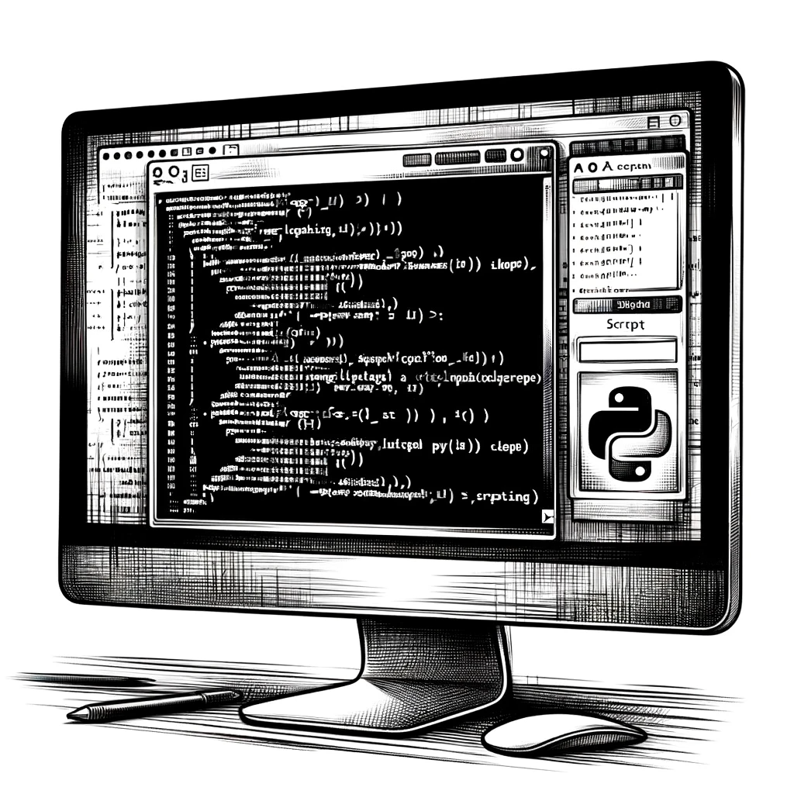

# The Echo

A week after his foray into the Reddit community, the digital echoes around David's post about the Umbrella Group had simmered down. He had shifted his focus back to the monitoring tools he had set up to keep a vigilant eye on the LinkedIn profiles connected to the Umbrella Group. David's strategy was to capture any subtle shifts or changes that might slip unnoticed by the average observer.

As he sifted through the regular notifications, a pattern began to emerge, one that piqued his interest. The profiles he had been tracking, those linked to the enigmatic Umbrella Group, were undergoing a peculiar transformation. Information related to the Umbrella Group, previously flaunted on these profiles, was being methodically erased, as if someone had given the command to purge all traces of the connection.

"It's like watching shadows retreat from the light," David thought, his eyes narrowing in suspicion. He had anticipated such moves and had meticulously saved all their information and contacts earlier. This foresight was proving crucial now, as the digital landscape before him altered with each passing day.

His setup for monitoring changes on LinkedIn was more than just a precaution; it was an essential tool in his investigation. The Python script he had written was now sending him frequent alerts, signaling changes in the connections of these profiles. Among the various notifications, one particular development stood out: two profiles that had previously been linked to the Umbrella team had completely severed this connection on LinkedIn.

"This is more than just a coincidence," David muttered to himself, leaning closer to his computer screen. The disappearance of these connections wasn't just a routine update; it was a deliberate act.

David's investigation, which had started as a curious exploration, was now morphing into a game of digital cat and mouse. Each clue led to more questions, each revelation brought more intrigue.
