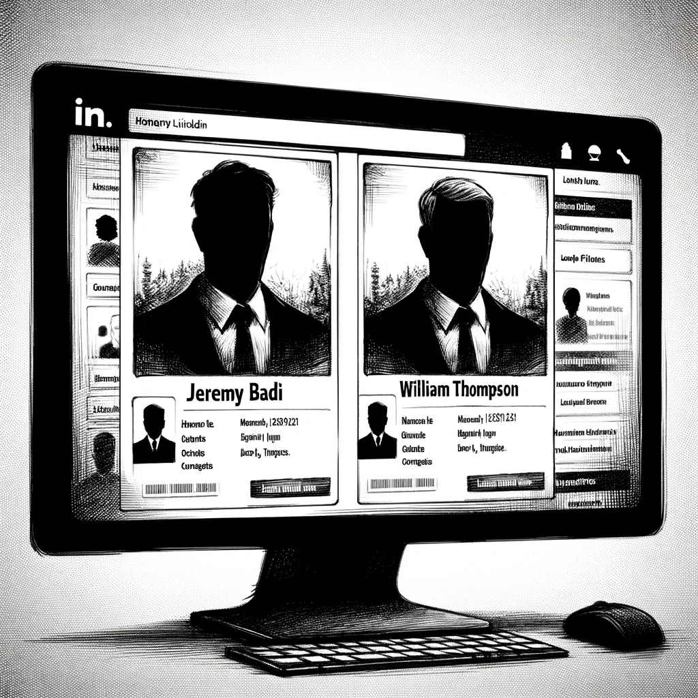

# Diving Deeper

Dan's investigation delved deeper, unraveling a web of connections and coincidences. Two individuals, Jeremy Badi and William Thompson, with active LinkedIn profiles and no overt connection, emerged as figures of interest. Their careers as self-employed entrepreneurs in the blockchain sector and consistent attendance at AI conferences painted a curious picture.

"Could there be a hidden link?" Dan pondered, scanning their profiles. Despite their frequent attendance at the same AI and blockchain events over the past year, there were no photographs or social media posts suggesting a personal acquaintance. Yet, the alignment in their professional interests and activities was too consistent to be mere coincidence.

Dan's analytical mind kicked into higher gear. Running a script to meticulously analyze their conference attendance patterns, he uncovered a recurring theme: beyond blockchain and AI, there was a distinct focus on military topics. This discovery added a new layer to the puzzle, suggesting a convergence of interests in technology and defense.

Piecing together this mosaic of information, Dan formed a hypothesis:

1. The game development company A.V.A.M. Ltd. had outsourced its AI core engine, with the true ownership remaining a mystery.
2. The Umbrella Group, including current and former employees, had systematically erased all public references to the organization, possibly under directive.
3. Jeremy Badi and William Thompson had strategically disconnected their profiles from Umbrella Group employees, further obscuring any direct links.

Yet, despite these precautions, their parallel tracks at various conferences, particularly those focusing on military applications, were undeniable. They had even been spotted at military exhibitions within the last month.

A wry smile crossed Dan's face as he leaned back in his chair. "This is starting to sound like something out of a conspiracy theory. Maybe I should start wearing a foil hat," he joked aloud to himself. The complexity and secrecy of the connections he was uncovering were both intriguing and baffling, propelling him further into the depths of his investigation.

