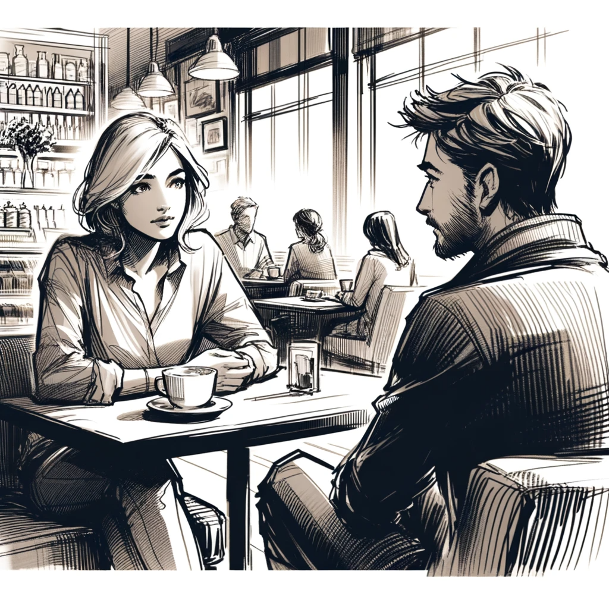

# Unraveling Mysteries

Feeling uncertain about his next steps, David decides to reach out to Lilla. He sends her a message, trying to keep it light: "Hi, it's been a while. Could we meet? P.S. It's not a date ;)"

Lilla's response comes quickly: "Hi! Sure, let's meet on Saturday at our usual café at noon."

Arriving early at the café, David orders a coffee, anticipating Lilla's usual tardiness. To his surprise, she arrives just as the waiter serves his coffee.

"Please, I'll have the same," Lilla says, taking a seat opposite David.

"I'm guessing you've got an interesting story," she starts. "And I'm ready to hear it."

"It's about the Dark Alert game," David begins cautiously. "Are you familiar with it?"

"Oh, yes," Lilla replies. "It's been in the news quite a bit lately. They've had a lot of investment, especially after incorporating AI into their gameplay."

"Right, but there's more to it," David explains. "The latest AI integration isn’t just for balancing gameplay or managing bots in a typical sense. In Dark Alert, the AI is more autonomous. It doesn’t have access to server data or extra information about players. It's designed to analyze the battlefield from its own perspective, making independent decisions based on what it sees and hears through the player's commands, much like in real warfare."

Lilla, her journalistic instincts piqued, asks, "What's the bigger picture here?"

David hesitates for a moment, then shares his hypothesis about the Umbrella Group and their possible connection to the military use of AI. He details his Reddit post about the suspiciously worded agreement of Dark Alert and the LinkedIn profile changes.

Lilla listens intently, her initial amusement giving way to concern. "This is deeper than I imagined. Your story, while frightening, sheds light on the potential military applications of AI that are being explored under the guise of a game. It's a story that needs to be told, but with caution."

As their meeting draws to a close, Lilla jokes, "Next time, ask me out on a proper date, not to discuss a new investigation." But her eyes convey the seriousness of what they had uncovered.

Leaving the café, David feels a renewed sense of purpose. The meeting might not have been a date, but it had sparked a fire within him, a determination to unravel the mysteries of the Dark Alert game. The pieces of the puzzle were slowly coming together, and David knew he was on the brink of something significant.
