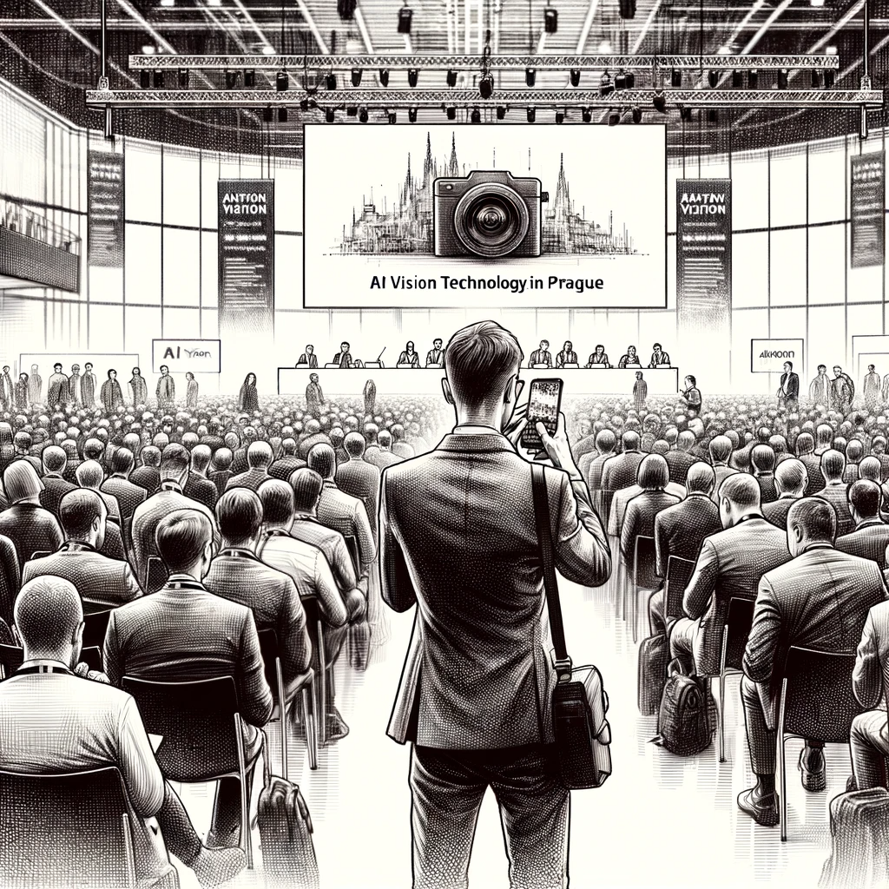

# The Prague Pursuit

March brought Dan to the charming city of Prague, under the guise of a business trip. The conference this time centered around AI vision technology, a field that had always piqued Dan's curiosity. However, his real motive for attending was far from just professional interest.

Armed with the knowledge and experience from his previous venture in Lisbon, Dan was more determined and focused. He roamed the conference halls, blending in with the crowd of tech enthusiasts, his eyes meticulously searching for the familiar face from his investigation.

Luck seemed to be on his side in Prague. Amidst a crowd gathered around a group of keynote speakers, Dan spotted one of the individuals from his list - Jeremy Junior. The man was actively engaging with the speakers, occasionally taking photos with them. It was a golden opportunity for Dan.

Subtly maneuvering through the crowd, Dan discreetly captured photographs of this individual and his interactions. Each photo, handshake, and exchanged business card were potential leads that could help unravel the web he was trying to untangle. He was careful not to draw attention to himself, using his phone's camera inconspicuously.

However, despite his efforts, the outcome of the conference felt underwhelming. Dan had hoped for a direct interaction, a chance to glean more than just faces and contacts. But the individual remained preoccupied, always surrounded by a throng of attendees.

Leaving Prague, Dan felt a sense of disappointment mixed with anticipation. He had gathered a trove of visual data, which could potentially lead to significant breakthroughs. Yet, the lack of direct engagement left him feeling like he had only skimmed the surface. "Catch too small," he mused, wondering what his next step should be in this intricate game of cat and mouse.

