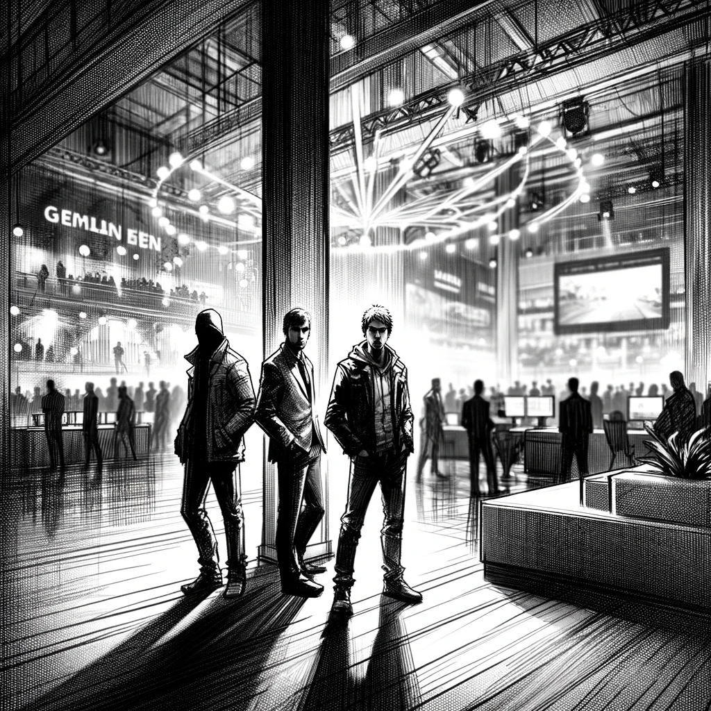

# Shadows in the Spotlight

As the "gg" competition in Berlin reached its fever pitch, Dan's attention shifted from the dazzling displays of gaming prowess to a more subtle yet intriguing sight. In a dimly lit corner of the venue, away from the enthusiastic crowd and the electrifying atmosphere, stood three individuals who seemed out of place amidst the gaming extravaganza.

Among this trio, two faces were familiar to Dan - "Jeremy Junior" and "William Thompson," names that had surfaced in his ongoing investigation. Their presence at the gaming event was a puzzle in itself. But it was the third figure, shrouded in the room's shadows, that piqued Dan's curiosity the most.

Straining his eyes to see through the dim light, Dan tried to bridge the distance, inching closer to get a better view, and perhaps even capture a photo. However, every attempt to close the gap was met with obstacles, be it the shifting crowd or the strategic positioning of the trio.

Frustration mounting, Dan focused intently, trying to etch the third person's features into his memory. There was something strikingly familiar about him, a sense of déjà vu that Dan couldn't shake off. Yet, the identity remained elusive, hidden just beyond the reach of his recollection, like a word on the tip of his tongue.

As the event continued, Dan couldn't help but feel that he had missed a crucial piece of the puzzle. The shadows in that corner held secrets, ones that might be key to unraveling the mysteries he was chasing. But for now, they remained just out of his grasp, hidden in the dim light of the Berlin gaming gala.

