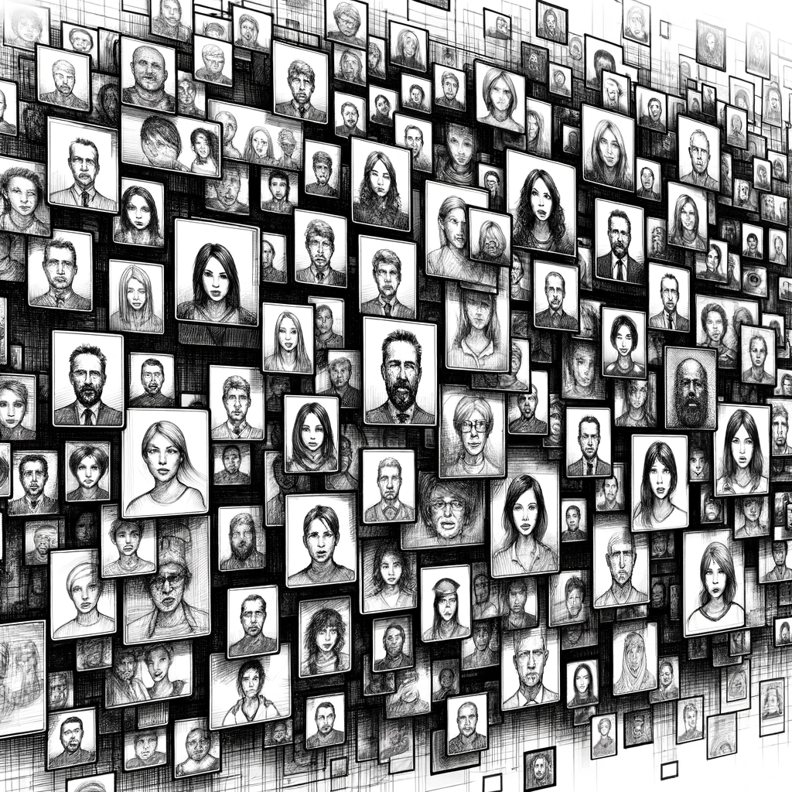

# The Elusive Shadow

Back in the familiar confines of his Budapest apartment, Dan embarked on a meticulous quest to uncover the identity of the elusive figure he had glimpsed in Berlin. Without a clear photograph to feed into his AI assistant, he relied on the oldest tool in the investigator's kit - his own memory and intuition.

He began with the most recent and obvious source - the photo archives from the events he had attended. Scrolling through the digital albums, he examined each face, hoping for a spark of recognition. However, this avenue yielded no results. The mysterious individual from the Berlin event remained absent from these captured moments.

Undeterred, Dan shifted his focus to the LinkedIn contacts of Jeremy Junior and William Thompson. He had meticulously documented these connections during his previous investigations. One by one, he scrutinized the faces in the myriad of professional profile pictures, searching for any semblance of the person he had seen in the dim light of the gaming event. Yet, this too proved fruitless.

His next step was more arduous. He pored over the contacts of the Umbrella Group members, specifically those with more than one mutual connection. The logic was sound; perhaps this shadowy figure moved in the same circles as the Umbrella Group. Hours turned into days as Dan examined over a hundred photos, but the person he sought remained just out of reach, an enigma lost in the sea of digital faces.

With dwindling options, Dan turned his attention to the last significant set of photos - those related to the AI Church bots. This task was daunting, given the sheer volume of the images and the complexity of the connections. Resigned to the magnitude of the challenge, Dan set aside the following weekend for this deep dive. The elusive shadow continued to hover just beyond the edge of understanding, urging him to delve deeper into the labyrinth of images and connections.
