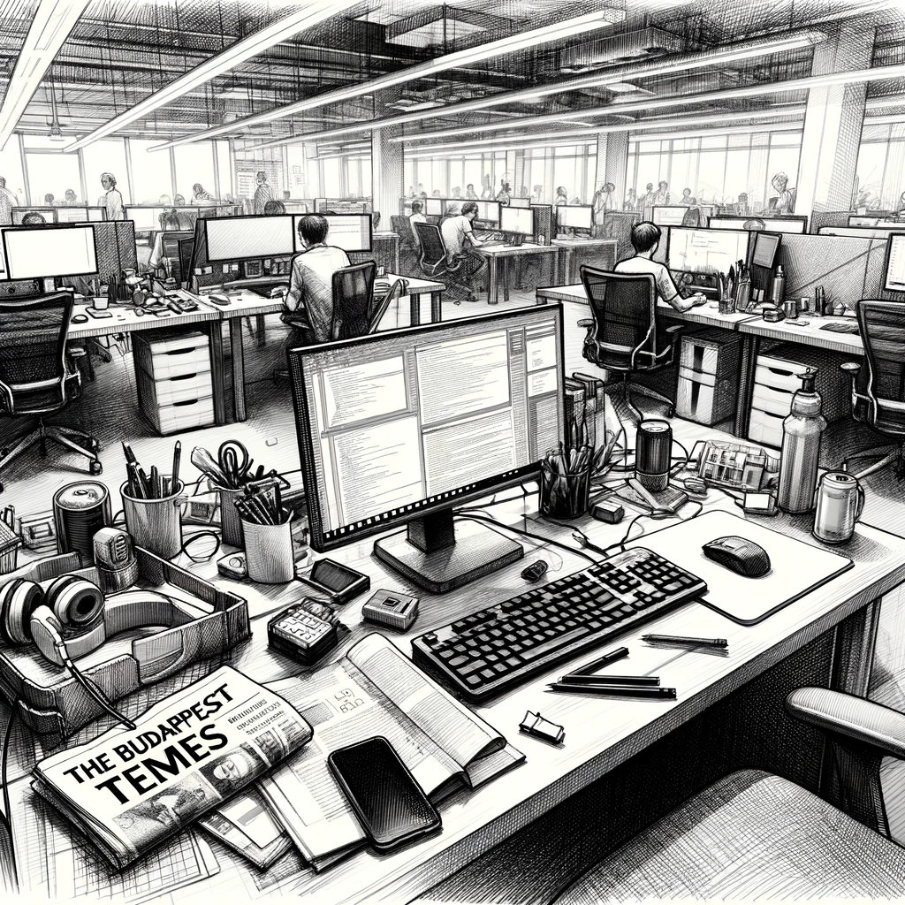

# A Breakthrough in Print

The routine of office life enveloped Dan, providing a stark contrast to the intrigue of his ongoing investigation. The start of the week was consumed with the mundane yet necessary task of updating the web scrapers - tools essential for the smooth operation of his AI assistant. These scrapers were the digital tentacles that reached out into the vast ocean of the internet, retrieving crucial data for analysis. By Tuesday, Dan had successfully integrated support for ten additional web resources, enhancing the AI's reach and capabilities.

Feeling the weight of the monotonous work, Dan decided to break the tedium by organizing his cluttered workspace. Amidst the assortment of tech gadgets and papers, he stumbled upon an old copy of a newspaper. It was the same edition where Lilla's article on military AI technology had first caught his attention.

As he flipped through the pages, revisiting the familiar article, his eyes fell upon a photograph that reignited his investigative spark. There, in the glossy print, was the same man he had seen in the shadows of the Berlin gaming event, conversing with Jeremy Junior and William Thompson. The photo, taken at a different military exhibition, captured the man's features more clearly, though his name remained elusive in the article's text.

Dan felt a surge of excitement. This photograph was the missing piece he had been searching for, a tangible link to the shadowy figure whose identity had evaded him. He quickly grabbed his phone and sent a message to Lilla, the one person who could possibly help him unravel this mystery further.

"I have news. Tomorrow at 10:00?" he texted, hopeful for a meeting.

Lilla's response was prompt and affirmative, a simple "Ok :))" that set the stage for their next encounter. Dan felt a renewed sense of purpose as he prepared for what he hoped would be a significant step forward in his investigation. The picture in the newspaper had opened a new door, and behind it lay answers he had been seeking for so long.

