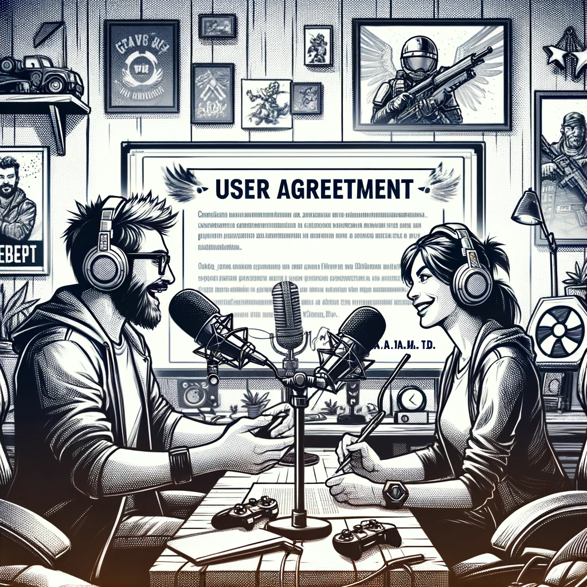

# A New Agreement

As the dust settled on the recent uproar, A.V.A.M. Ltd. took a proactive step to rebuild public trust by updating the user agreement for their game, "Dark Alert." In an effort to address the concerns highlighted in Lilla's article, the revised agreement presented players with newfound autonomy over their AI models.

The updated document offered players a crucial choice: to either permit the company to utilize their AI models for further development or to keep these models private. This marked a significant departure from A.V.A.M. Ltd.'s previous policy, showcasing a move towards greater transparency and sensitivity to public sentiment.

Avraam Vin, the company's CEO, accompanied the release of the new agreement with a statement underscoring the firm's commitment to ethical practices:

"We acknowledge and respect the apprehensions raised. Our new agreement is a testament to our commitment to empowering our players, safeguarding their rights, and ensuring the protection of their privacy."

This initiative was met with a positive response from the gaming community, with many players commending "Dark Alert" for its responsiveness and willingness to adapt its policies. The move also ignited wider discussions within the gaming industry regarding the ethical handling of AI and player-generated content.

Yet, skepticism lingered among some quarters. Critics perceived the company's actions as a tactical PR maneuver, questioning the authenticity of A.V.A.M. Ltd.'s intentions and casting doubt on whether such changes would meaningfully alter AI model usage in the broader gaming industry.

In a revealing turn of events, a fortnight after the new agreement's publication, the company disclosed that a significant portion of players seemed unbothered by the potential uses of their AI models. Surprisingly, about half of the players consented to unrestricted use of their models, even if that meant involvement with military companies.

Moreover, certain players found themselves beneficiaries of new sponsorships from military organizations, accompanied by additional contracts granting these sponsors free rein over the players' AI models.

Contemplating these developments, Dan couldn't help but feel a mixture of astonishment and disillusionment. The world, in his eyes, appeared to be veering into a realm of uncharted ethics and morality. "This world is crazy. God, please burn it," he muttered, reflecting on the bizarre trajectory society seemed to be taking.
