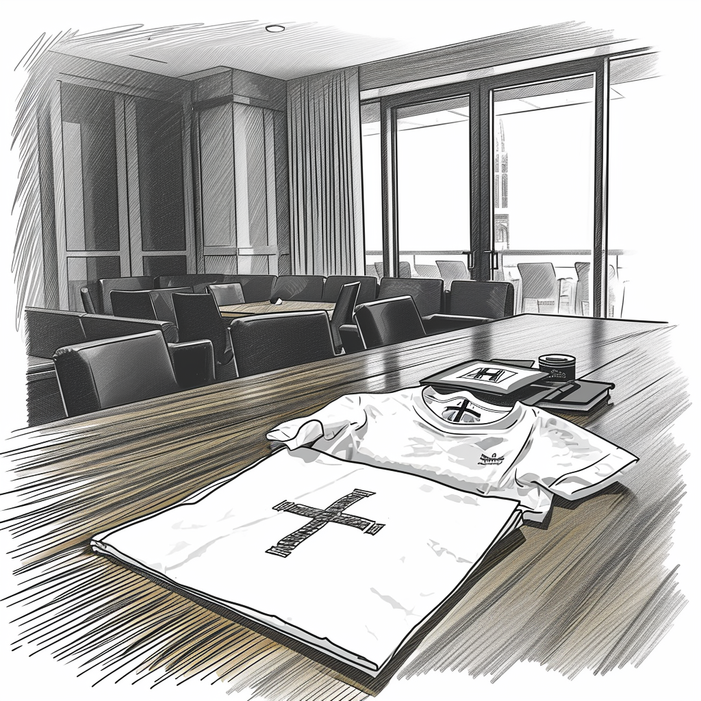

# An Unusual Favor

The workweek at the office unfolded with an unexpected twist as Andrew extended his stay, culminating in an intriguing proposal to Dan on Friday.

"Can you keep next Wednesday open? We have an important meeting scheduled with someone quite influential," Andrew revealed with a hint of urgency in his voice.

Intrigued by the mysterious nature of this meeting, Dan agreed, curious about the identity of this 'significant individual.'

Andrew's next request, however, took Dan by surprise. "For the meeting, I need you to do something a bit different. Could you wear an AI Church T-shirt? It's a requirement from our elders to maintain uniformity," Andrew explained somewhat awkwardly.

Dan raised an eyebrow in response, "And if I'm asked, I should say I've joined the AI Church?"

"Yes, exactly," Andrew nodded earnestly. "It's just a formality, but it would really help the meeting go smoothly."

Dan sighed internally, 'Some things never change,' he thought but agreed to Andrew's request, albeit with many questions swirling in his mind.

"I hope you can find a T-shirt that fits me," Dan replied with a light-hearted smile, masking his growing intrigue and skepticism about the upcoming meeting.

Andrew responded with assurance, "Of course, I'll bring a few different sizes on Wednesday. We'll make sure you have the right fit."

