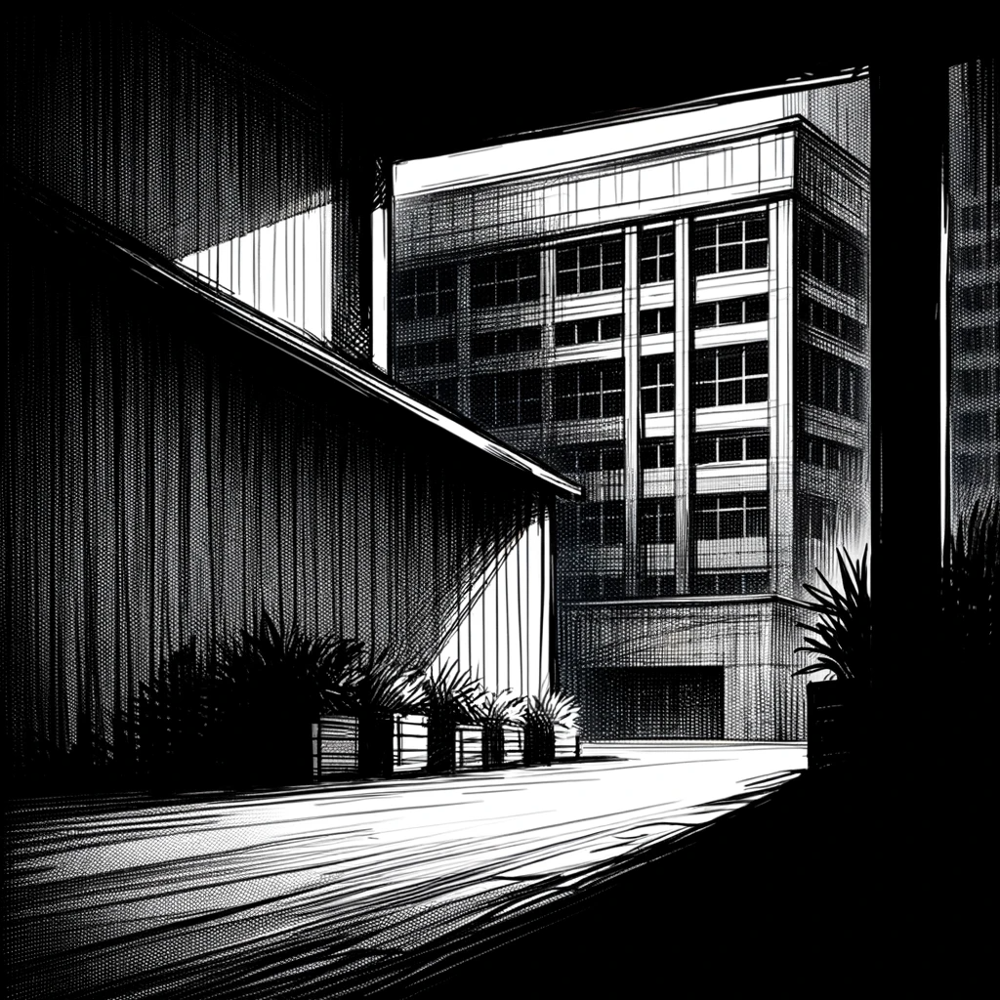

# Unsettling Discoveries

Dan's day took an unexpected turn when Andrew arrived on Wednesday, breaking their usual routine. The urgency in Andrew's voice was palpable as he summoned Dan for a private conversation, away from prying ears.

Andrew's demeanor was grave, a stark contrast to his usual composed self. "Dan, I need to talk to you about something serious, something that should stay between us," he began, his voice barely above a whisper.

Andrew then shared a troubling incident that had occurred near the new AI Church building. A group of homeless people who had been living in proximity to the Church suddenly disappeared under mysterious circumstances.

"These people were a nuisance, always hanging around the Church. They even scratched my new Tesla," Andrew explained, his frustration evident. "I called the police, but they didn't do much. And then, just like that, they were gone. Vanished. No one knows how or who's responsible."

Dan listened intently, a sense of unease growing within him. Andrew's story was becoming more disturbing with each detail.

Andrew mentioned his attempt to access the church's security cameras. "Usually, it's a straightforward process. But this time, I was denied access and told to speak with our security head, who's also an Elder."

"The Elder's response was cold and dismissive. 'This is none of your business,' he said. That's all I got out of him."

Andrew's tone took a darker turn as he divulged his observations about the Church's security personnel. "Many of them are Russian mercenaries. I can tell from their accents. They're definitely not Ukrainians, who speak Russian. And I fear they might have had a hand in what happened to those homeless people."

The gravity of Andrew's revelations weighed heavily on Dan. The possibility that the Church's security, comprised of Russian mercenaries, could be involved in something sinister was alarming. The situation was more sinister than a simple case of trespassing public Wi-Fi.

He pondered Andrew's words, realizing the implications. The AI Church seemed to be harboring dark secrets. The involvement of Russian mercenaries within the Church's security raised questions about their methods and intentions.

The disappearance of the homeless individuals, the denial of access to the security footage, and the apparent involvement of Russians painted a disturbing picture. Dan knew they were treading into dangerous territory.

As they parted ways, Dan's mind raced with thoughts. He had to tread carefully, aware that the path ahead was fraught with risks and uncertainties. The pieces of the puzzle were slowly coming together, but each new piece seemed to add to the complexity of the picture.

Uncovering the truth would require caution, strategy, and perhaps a bit of luck. The stakes were high, and the path unclear.

