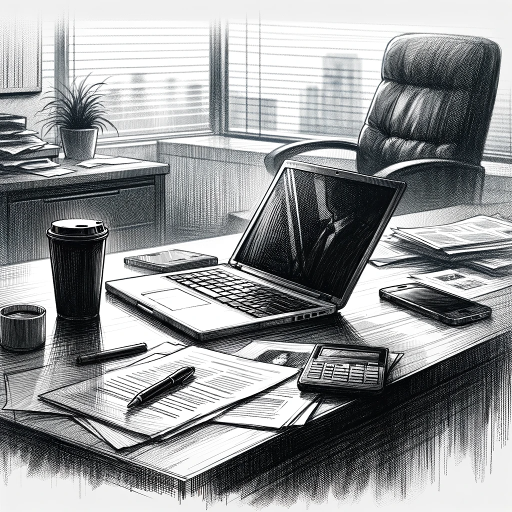

# Shadows and Silence

As the Friday workday drew to a close, Andrew shared the latest unsettling developments in his investigation with Dan. Despite his persistent efforts, Andrew had hit a wall in uncovering details about the AI Church's security service.

"I can't find anything concrete, Dan," Andrew said, his voice tinged with frustration. "The only name I have is John Stuart, the Elder in charge of security. But that's just a pseudonym. He doesn't look like any John I've ever seen."

Dan listened, sensing the underlying tension in Andrew's voice.

"He's more like an Arabic man, quite charismatic but with a chilling gaze," Andrew continued, describing the elusive John Stuart. "I've heard he's the one hiring Russians for... certain tasks."

"The kind of tasks?" Dan asked, already dreading the answer.

"The unsavory kind," Andrew replied, lowering his voice. 

"The Russians in the security team, they seem to take orders from him," Andrew continued. "But they call him something else – Ifrit. It's like a code name or a nickname."

Andrew's voice dropped to a whisper, "I think I've dug too deep, Dan. I'm worried that Ifrit knows I'm snooping around. After what happened to those homeless people... it's like they just disappeared. 'No people, no problem,' right?"

The gravity of the situation was not lost on Dan. Andrew's fear was palpable, and the mention of Ifrit only added to the ominous nature of their investigation.

Changing the subject, Andrew suddenly pulled out his laptop. "I've gathered everything I could find and stored it here," he said, patting the laptop. "Just in case anything happens to me."

Dan nodded, understanding the risk Andrew was taking. "Sure, I'll keep it safe."

As Andrew prepared to leave, he whispered the password to Dan, a formality since Dan already knew it. "I'll be back on Monday," Andrew said, his tone a mixture of hope and apprehension.

Andrew planned to spend the weekend in Vienna and return on Monday. As he left the office, his usual confident stride seemed diminished, replaced by a cautious tread.

Dan watched him leave, the laptop in his hands feeling heavier than its physical weight. The implications of Andrew's investigation, the shadowy figure of Ifrit, and the unresolved questions about the AI Church's activities loomed large in his mind.

The office's stillness felt more pronounced now, a stark contrast to the storm brewing. Dan knew that the weekend would be anything but relaxing, with the burden of Andrew's findings.

