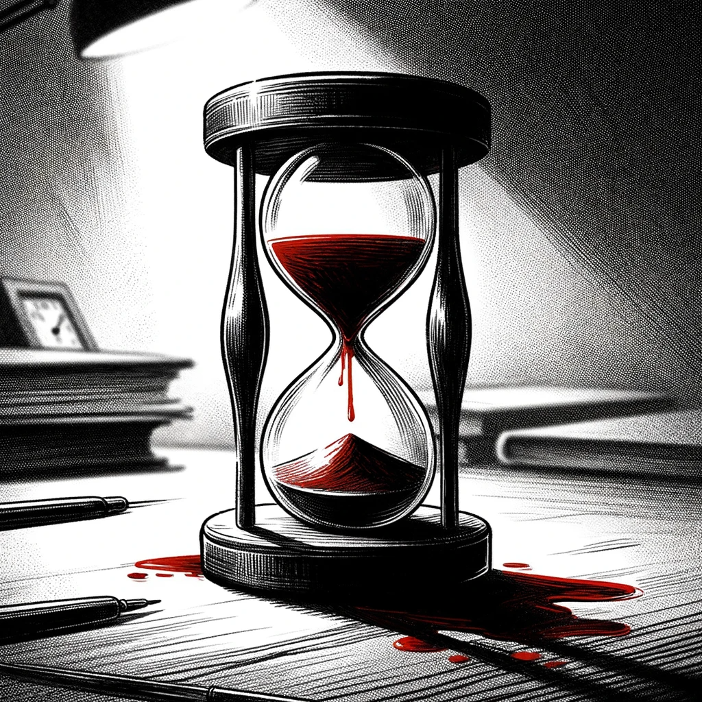

# Revelations

On a somber Wednesday, Dan took a day off. His chief, understanding the circumstances, allowed it without question. The silence of his home offered a stark contrast to the bustling office environment, providing him with the space to process recent events and delve into Andrew's laptop.

Opening the laptop, Dan found the browser was still open. Andrew's personal Gmail account was open in one of the pinned browser tabs. A draft email intended for Dan caught his attention. The draft was Andrew's contingency plan – a message to be sent if he ever found himself in grave danger.

Andrew's message began with a resigned tone: "If you received this message, then I lost this battle. But I hope you will win the war."

The contents of the email were revealing. Andrew's journey with the AI Church began four years ago, guided by William Thompson. Throughout his time with the organization, Andrew had been part of various projects, believing they were meant for the betterment of humanity. But deeper within the Church lurked "The Order of the Resistance" – a faction preparing for an AI-dominated future, anticipating a conflict where AI would threaten human existence.

The Order's mission was paradoxical. They aimed to be ready for a reality where AI might enslave or destroy humanity, yet they didn't seek to halt AI development. Instead, they prepared for minimizing losses in an inevitable confrontation they believed would claim thousands, if not billions, of lives.

Andrew's letter shed light on the Order's business of selling safety places in the vaults. Each vault was a sanctuary for those who could afford the steep price, ranging from 10 BTC for basic accommodation to 1,000 BTC for premium spaces.

Dan's eyes widened as he read the list of 25 BTC wallets, each managed by an Elder responsible for a vault. Andrew had managed to uncover only William Thompson's wallet but had provided a complete list of all the Elders.

The most chilling revelation was The Order's intention to initiate a war with AI, a move to showcase the dangers of the technology. To achieve this, they were prepared to go to any lengths.

Andrew's story about the homeless people, Ifrit, and the security department further painted a grim picture of The Order's ruthless methods.

Dan realized the gravity of the information he was reading. This was more than just a conspiracy theory; it was a well-orchestrated plan with global implications.

Unfortunately, the documents Andrew referred to were not attached to the email. After a thorough search, Dan found them hidden in a folder humorously labeled 'porno' on the desktop. "Classic Andrew," Dan thought, a hint of a smile crossing his face amidst the seriousness of the situation.

Merging this new information with what he already knew, Dan crafted a comprehensive narrative. It included the AI Church's manipulation of information, the network of bots, BTC wallets, and the link between the "Dark Alert" game and William Thompson.

Dan removed his email from the recipient list of the draft and added addresses of several international newspapers. He scheduled the email to be sent on Andrew's upcoming birthday, a posthumous gift of truth to the world.

After carefully removing all traces of Andrew's investigation from the laptop, Dan logged out of Andrew's Gmail account on all devices, including the laptop itself.

On Friday, AI Church security personnel arrived at the office. They collected all of Andrew's belongings, including the laptop, leaving no physical remnant of Andrew's presence.

Now, all that was left for Dan was to wait.

