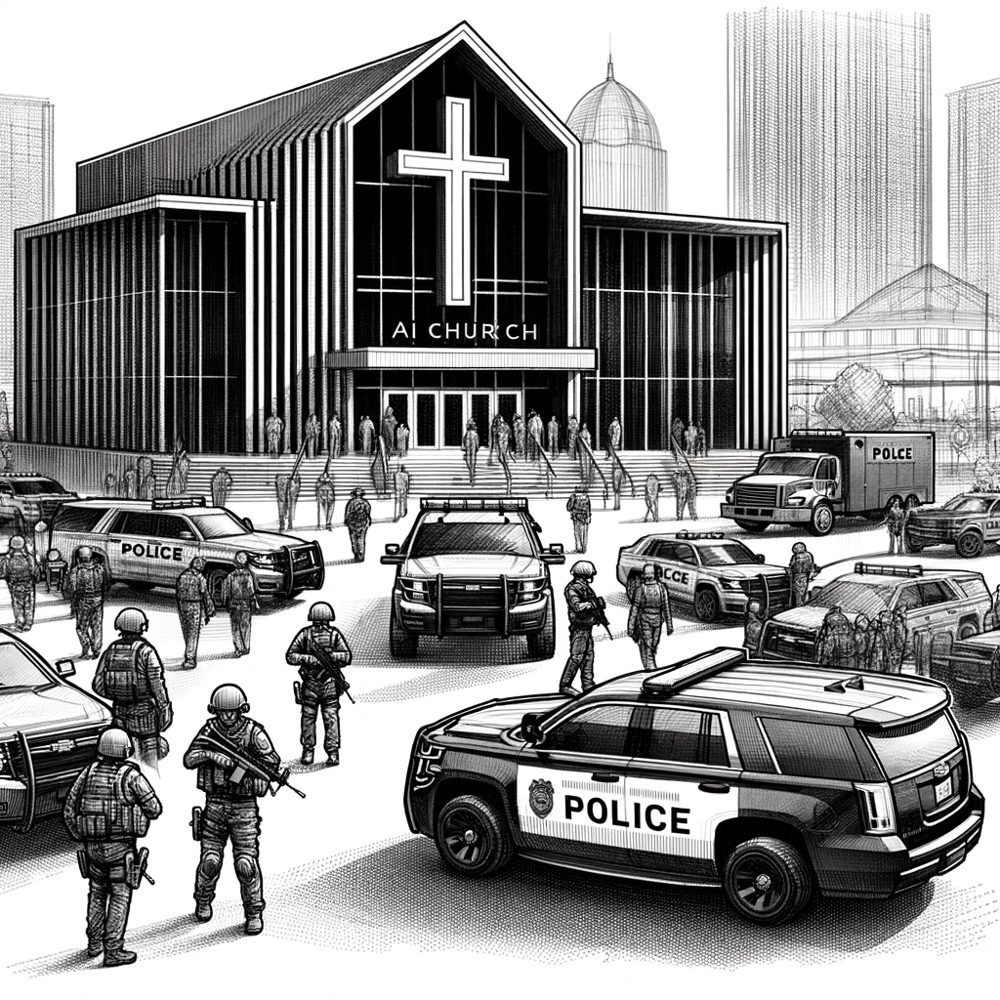

# The Fallout

The publication of the letter triggered a seismic shift, sending shockwaves across the globe. It struck at the very heart of the AI Church, freezing its operations and leading to a series of high-profile arrests. International law enforcement agencies, including Interpol, the FBI, and the CIA, swiftly joined forces to unravel the sprawling web of deception and illegality at the core of the Church.

Many of the Elders, once-shadowy figures behind the AI Church, found themselves in custody, facing not only charges related to the Church's activities but also allegations of massive tax evasion. Their BTC assets were frozen by law enforcement. Yet, a few remained at large, controlling substantial BTC reserves. These remaining wallets, although active, became a proverbial cursed treasure. Constantly under the watchful eyes of law enforcement and Dan himself, these wallets represented the remnants of a fallen empire, a symbol of greed and corruption that had once thrived under the guise of progress and innovation.

Among the Elders who escaped justice was Ifrit. He seemingly vanished, leaving no trace behind for authorities to follow.

Some security persons, including the Russian mercenaries, were apprehended. Their confessions were stark and unapologetic: "We had orders to deal with the problem. Nobody cares about the homeless; the world is better off without them." These words echoed the ruthlessness and moral decay that had infested these individuals.

A pivotal breakthrough came in the investigation of Andrew's tragic death. Detailed technical evidence emerged, pointing to a deliberate sabotage of his Tesla by Russian mercenaries. It was a stark reminder of the lengths to which the Church and its affiliates would go to silence their adversaries.

The network of AI Church bots, a key element in Dan's investigation, faced its downfall. The revelation of their BTC wallets and the subsequent tax evasion charges led to widespread arrests.

The AI Church, in its bid to conceal financial transactions, had created a dedicated BTC mixer. This move was intended to obscure the origins of their substantial Bitcoin transactions. However, in a twist of fate, this very strategy backfired. The Church's mixer, designed to economize by avoiding external mixing fees, became their Achilles' heel. The transactions were only mixed among other wallets affiliated with the AI Church, creating a discernible imprint on the blockchain.

This anomaly did not go unnoticed by the astute members of the Reddit community. Armed with keen analytical skills and a drive to uncover the truth, these digital detectives began dissecting the blockchain data. Their collaborative efforts soon bore fruit, revealing over 50,000 wallets connected to the AI Church.

A group of users on Reddit also created an interactive website equipped with a user-friendly interface that allowed anyone to search and analyze these wallets. The website became a hub for crowdsourcing information, enabling users to dig deeper into the transactions. But with time, it transformed into more than just a tool for analysis; it became a digital confessional.

The site's UI allowed users to leave comments on each transaction. Initially intended to de-anonymize wallet owners, the comment section evolved into a platform for uncovering acts of corruption.

People from all over the world began to use the site's comment feature to anonymously disclose their involvement with the transactions. These comments weren't just observations; they were admissions. Individuals confessed that certain transactions were indeed theirs and that these represented bribes or under-the-table payments. The anonymity of the internet provided a veil of safety, allowing people to confess without revealing their identities.

These anonymous admissions brought a human element to the previously impersonal transaction data. They provided context and stories behind the numbers, turning the blockchain entries from abstract data points into real-world narratives of corruption.

As the website gained traction, it became a repository of thousands of stories, each transaction linked to a personal account of bribery, fear, and the human cost of corruption. The site's impact was far-reaching, propelling the investigation to a new level. Law enforcement agencies, including Interpol, used these data as leads, piecing together the complex puzzle of facts of corruption.

The illusion of online anonymity was shattered, and the consequences reverberated globally. Consequently, thousands of arrests were made worldwide, and the Bitcoin market plummeted, experiencing its lowest rates in five years.

Despite the crackdown and the Church's tarnished reputation, a group of devout followers persisted. Their narrative shifted dramatically from worshiping AI to perceiving it as a formidable enemy. This transition marked their transformation from a seemingly enlightened group to apparent fanatics.

The AI community, spurred by these events, rallied to establish a set of ethical guidelines and doctrines for AI, particularly in the military sector. This movement marked a significant shift in the discourse surrounding AI, with an emphasis on responsible development and deployment.

As Dan reflected on these events, he couldn't help but feel a mix of satisfaction. Justice had been served.

